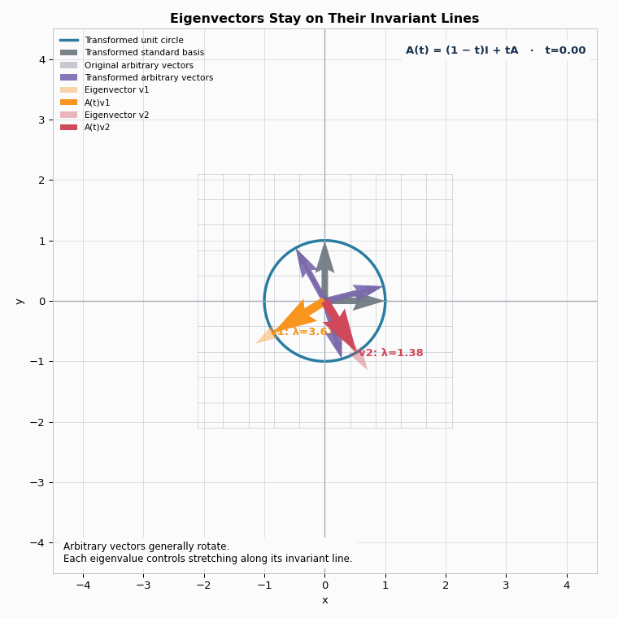
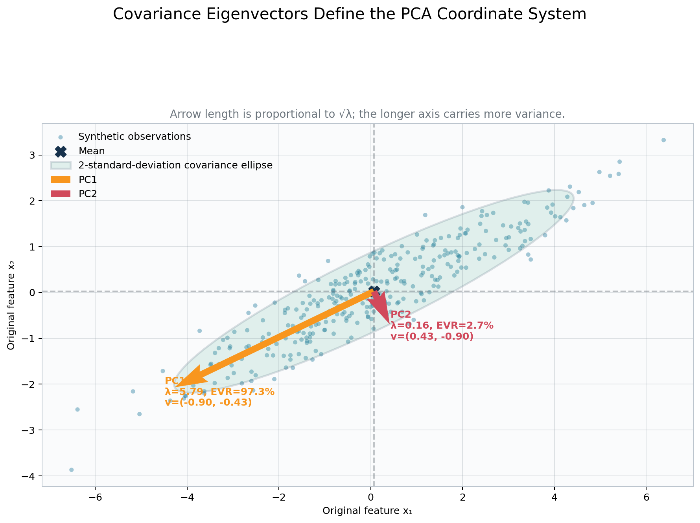
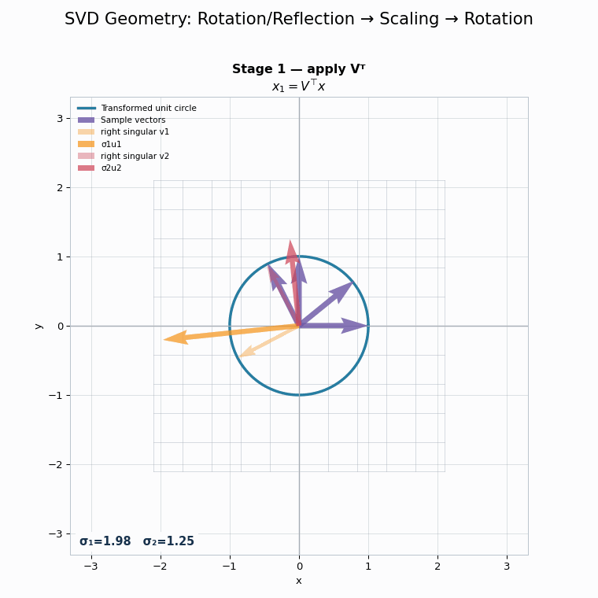
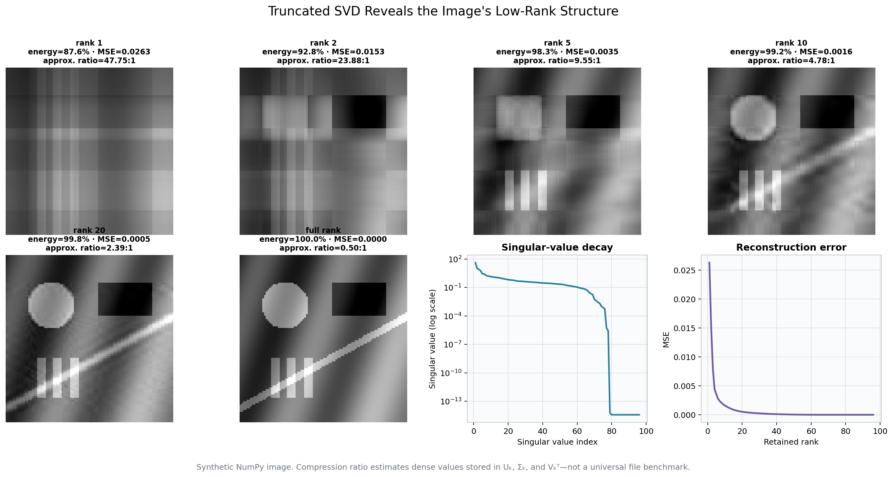

# Linear Algebra III: Eigenvalues, Eigenvectors, PCA, and SVD

## Overview

Eigenvalues and eigenvectors identify directions preserved by a linear
transformation. Principal Component Analysis (PCA) uses those directions in a
covariance matrix to construct orthogonal features ordered by captured
variance. Singular Value Decomposition (SVD) extends the same structural idea
to rectangular matrices and provides the usual numerical route for computing
PCA and low-rank approximations.

The examples use small synthetic datasets generated in code. They are
educational demonstrations, not benchmark studies.

## Concepts Covered

- Eigenvalues, eigenvectors, and eigendecomposition
- Symmetric positive-semidefinite covariance matrices
- PCA as variance maximization and reconstruction-error minimization
- Explained variance and component loadings
- SVD and its connection to PCA
- Truncated SVD and optimal low-rank approximation
- Centering, standardization, whitening, and sign indeterminacy
- Dimensionality-reduction trade-offs in ML and vector-search systems

## Why It Matters

PCA and SVD support visualization, denoising, compression, latent semantic
analysis, multicollinearity reduction, recommendation methods, and smaller
vector representations. More broadly, eigensystems appear in stability
analysis, optimization, graph algorithms, and Markov chains.

In production, dimensionality reduction is an engineering trade-off. Retaining
variance does not guarantee retaining label information or semantic neighbors.
A transformation must be fitted without leakage, versioned with the rest of
the preprocessing pipeline, and evaluated using downstream quality as well as
memory, latency, and reconstruction metrics.

## Files

- `notes.md`: intuition, theory, derivations, assumptions, trade-offs,
  applications, limitations, and common mistakes.
- `example.py`: scikit-learn PCA with direct numerical checks of the PCA-SVD
  relationship.
- `from_scratch.py`: educational NumPy implementation using eigendecomposition
  of the covariance matrix.
- `notebook.ipynb`: lightweight interactive entrypoint into the reusable visual
  package.
- `visual_lab/`: modular static, animated, Plotly, and Streamlit learning lab.
- `outputs/`: generated PNG, GIF, and standalone HTML assets.
- `interview_questions.md`: senior-level conceptual, mathematical, practical,
  and production questions with answers.
- `references.md`: books, papers, course material, and official documentation.

## How to Run

From the repository root, install the shared dependencies if needed:

```bash
python -m pip install -r requirements.txt
```

Run the scikit-learn example:

```bash
python 00-foundations/04-eigenvalues-eigenvectors-pca-svd/example.py
```

Run the first-principles implementation:

```bash
python 00-foundations/04-eigenvalues-eigenvectors-pca-svd/from_scratch.py
```

Both scripts generate their data locally and require no network access,
credentials, or external dataset.

## Visual Laboratory

This topic includes an interactive visual laboratory with geometric
animations, 3D PCA projections, preprocessing comparisons, and low-rank SVD
reconstructions. Every dataset and image is generated synthetically with a
fixed seed.

From this Day 4 folder, install the local requirements and generate all assets:

```bash
python -m pip install -r requirements.txt
python -m visual_lab.generate_visuals --all
```

Run the numerical and artifact tests:

```bash
python -m pytest visual_lab/test_visual_math.py
```

Start the interactive application:

```bash
streamlit run visual_lab/interactive_lab.py
```

Alternatively, launch it directly from the repository root:

```bash
python -m streamlit run 00-foundations/04-eigenvalues-eigenvectors-pca-svd/visual_lab/interactive_lab.py
```

See [visual_lab/README.md](visual_lab/README.md) for individual generation
commands, the conceptual purpose of every visual, and its limitations.

### Selected Outputs

**Invariant eigenvector directions**



**Covariance ellipse and PCA directions**



**SVD as input rotation/reflection, scaling, and output rotation/reflection**



**Truncated-SVD image reconstruction**



Interactive standalone views:

- [3D PCA axes](outputs/interactive/pca_3d_axes.html)
- [3D-to-2D PCA projection](outputs/interactive/pca_projection_3d_to_2d.html)
- [SVD rank slider](outputs/interactive/svd_rank_slider.html)

## Key Takeaways

- An eigenvector is an invariant direction of a square linear transformation;
  its eigenvalue is the scale factor along that direction.
- PCA finds orthogonal directions of maximum variance in centered data.
- If `X_centered = U @ diag(s) @ V.T`, the PCA directions are the columns of
  `V`, the scores are `U @ diag(s)`, and covariance eigenvalues are
  `s**2 / (n - 1)`.
- Truncated SVD gives the best rank-\(k\) approximation under the Frobenius and
  spectral norms.
- Centering is fundamental to classical PCA; standardization is a
  domain-dependent modeling choice.
- Explained variance is not a substitute for downstream validation.
- Refitting PCA changes the representation and may require recomputing stored
  features or rebuilding a vector index.
