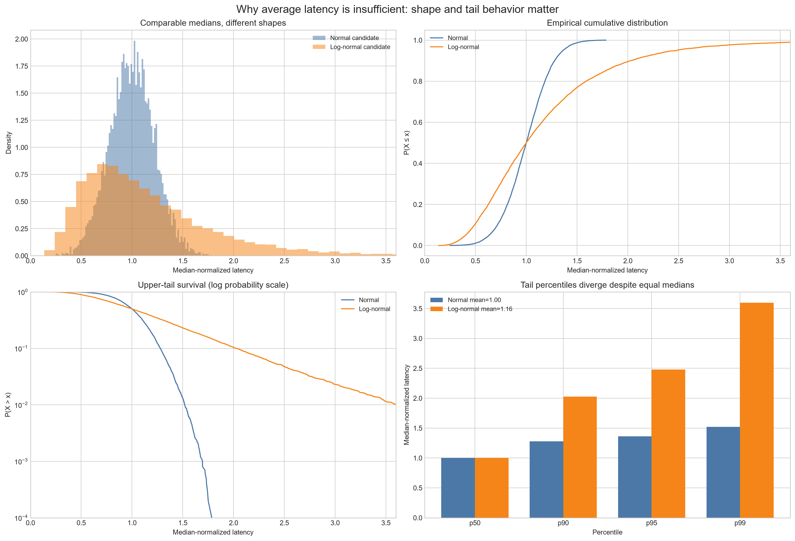
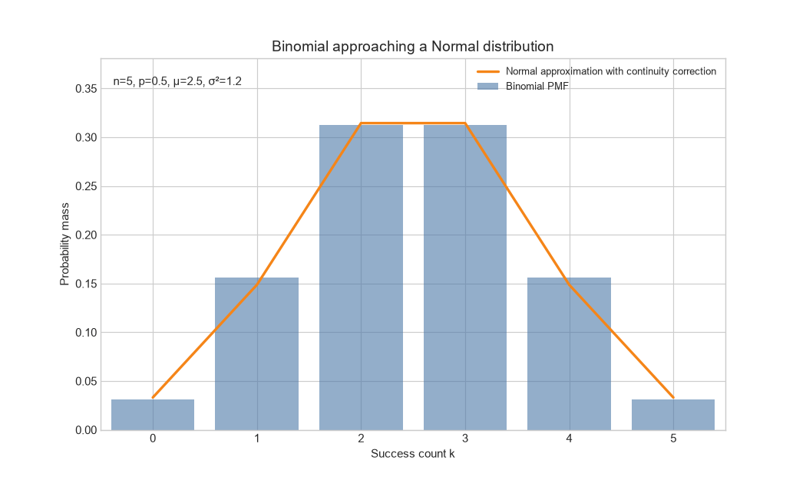
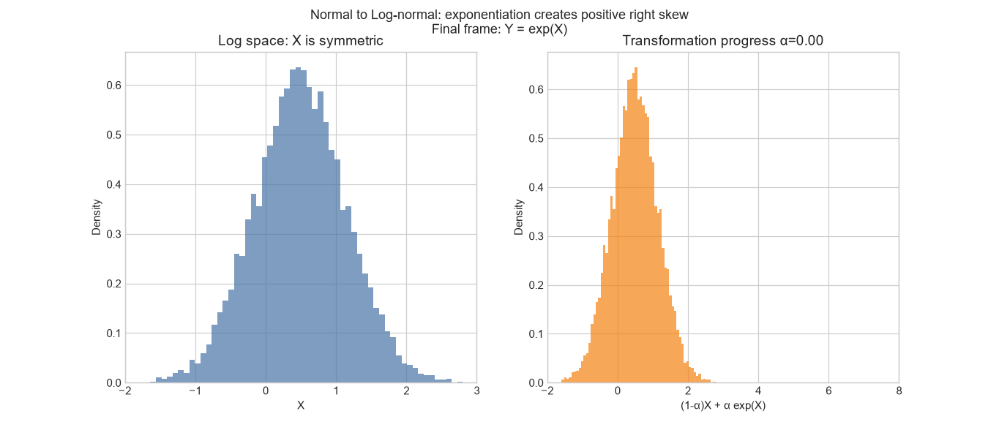

# Probability Distributions Visual Laboratory

## Overview

This Day 8 module is a visual and interactive laboratory for six foundational
probability distributions:

- Bernoulli
- Binomial
- Poisson
- Exponential
- Normal (Gaussian)
- Log-normal

It combines mathematical definitions with reproducible synthetic simulation,
high-resolution Matplotlib figures, animated GIFs, interactive Plotly surfaces,
a Streamlit dashboard, and a short Jupyter notebook.

The central goal is to reason from a variable's support and data-generating
mechanism—not only from the shape of a histogram.

## Concepts Covered

- Discrete probability mass and continuous probability density
- PMFs, PDFs, CDFs, survival functions, and hazard functions
- Theoretical versus empirical mean, variance, skewness, and percentiles
- Parameter sensitivity for all six distributions
- Mean, median, and mode under symmetry and right skew
- Bernoulli sums and the Binomial distribution
- Binomial-to-Normal and Binomial-to-Poisson approximations
- Poisson event counts and Exponential inter-arrival times
- Normal variables transformed into Log-normal variables
- Central Limit Theorem for Uniform, Exponential, and Bernoulli observations
- Probability assumptions behind common ML objectives
- Production-oriented examples for RAG evaluation, API traffic, waiting time,
  latency, and Gaussian regression residuals

## Why It Matters

Distribution choice determines valid support, likelihood, loss functions,
uncertainty estimates, anomaly thresholds, and tail probabilities.

In Applied AI systems, these distributions provide useful baselines for:

- whether one answer passes grounding validation;
- how many answers pass in a fixed evaluation batch;
- how many requests or incidents occur per exposure;
- how long until the next request;
- whether additive residual noise is plausible;
- how positive, right-skewed latency or cost behaves.

An incorrect family can assign probability to impossible values, underestimate
uncertainty, hide overdispersion, or make an acceptable mean conceal an
unacceptable p99.

## Project Structure

```text
08-probability-distributions/
├── README.md
├── notes.md
├── notebook.ipynb
├── example.py
├── from_scratch.py
├── distribution_utils.py
├── static_visualizations.py
├── generate_animations.py
├── interactive_dashboard.py
├── interview_questions.md
├── references.md
├── requirements.txt
├── tests/
│   ├── test_numerical_core.py
│   └── test_streamlit_app.py
└── outputs/
    ├── static/
    │   ├── distribution_overview.png
    │   ├── bernoulli_parameter_sensitivity.png
    │   ├── binomial_parameter_sensitivity.png
    │   ├── poisson_parameter_sensitivity.png
    │   ├── exponential_functions_and_hazard.png
    │   ├── normal_parameter_sensitivity.png
    │   ├── lognormal_parameter_sensitivity.png
    │   ├── mean_median_mode_comparison.png
    │   ├── normal_lognormal_tail_behavior.png
    │   └── probability_distributions.png
    ├── gifs/
    │   ├── bernoulli_probability.gif
    │   ├── binomial_probability.gif
    │   ├── binomial_to_normal.gif
    │   ├── binomial_to_poisson.gif
    │   ├── poisson_rate.gif
    │   ├── exponential_rate.gif
    │   ├── normal_mean.gif
    │   ├── normal_standard_deviation.gif
    │   └── normal_to_lognormal.gif
    └── html/
        ├── normal_sigma_surface.html
        ├── normal_mu_surface.html
        ├── lognormal_surface.html
        ├── binomial_probability_surface.html
        └── poisson_probability_surface.html
```

Generated assets are curated as part of this study module so the relative links
below render directly on GitHub.

## Files

- `notes.md`: detailed theory, formulas, assumptions, diagnostics, trade-offs,
  limitations, common mistakes, and a visual study map.
- `notebook.ipynb`: compact, editable experiments for moment convergence,
  approximation, tail behavior, and 3D exploration.
- `example.py`: lightweight empirical/theoretical overview using NumPy and
  Matplotlib.
- `from_scratch.py`: educational maximum-likelihood estimators implemented with
  explicit formulas.
- `distribution_utils.py`: shared validation, empirical summaries,
  Poisson-process simulation, approximation metrics, and Plotly surfaces.
- `static_visualizations.py`: high-resolution PNG collection and standalone
  Plotly HTML export.
- `generate_animations.py`: nine deterministic Matplotlib animations written
  with `PillowWriter`.
- `interactive_dashboard.py`: Streamlit and Plotly laboratory with bounded
  cached simulations.
- `tests/`: numerical regression tests and a Streamlit `AppTest` smoke test.
- `interview_questions.md`: senior-level conceptual, mathematical, practical,
  and system-design Q&A.
- `references.md`: books and authoritative technical documentation.

## Visualizations Included

### Static Matplotlib collection

The static generator creates:

1. empirical versus theoretical overview for all six distributions;
2. Bernoulli probability-mass sensitivity;
3. a 3×3 Binomial \(n,p\) comparison;
4. Poisson rate sensitivity;
5. Exponential PDF, CDF, survival, and constant hazard;
6. separate Normal location and spread effects;
7. Log-normal log-location, skew, and tail effects;
8. Normal versus Log-normal mean, median, and mode;
9. median-matched Normal and Log-normal latency candidates with histogram,
   empirical CDF, log-scale survival, and p50/p90/p95/p99.




### Animated GIF collection

- Bernoulli \(p: 0.01\rightarrow0.99\)
- Binomial \(p: 0.05\rightarrow0.95\), \(n=30\)
- Binomial approaching a continuity-corrected Normal approximation
- Binomial approaching Poisson while \(np=5\)
- Poisson \(\lambda: 0.5\rightarrow20\)
- Exponential rate, density, survival, and expected waiting time
- Normal mean changing with fixed standard deviation
- Normal standard deviation changing with fixed mean
- Normal samples transformed into Log-normal samples





### Interactive Streamlit laboratory

The sidebar selects:

- each of the six distributions;
- distribution relationships and CLT;
- synthetic production examples.

Every distribution view provides parameter controls, bounded synthetic sample
sizes, theoretical and empirical summaries, PMF/PDF, CDF, percentiles,
assumptions, an Applied AI interpretation, and a misuse warning.

Relationship views include:

- Bernoulli to Binomial;
- Binomial to Poisson;
- Poisson counts and Exponential waits on a timeline;
- Normal to Log-normal;
- Central Limit Theorem;
- rotatable 3D parameter surfaces.

Production views are explicitly synthetic and cover:

- RAG grounding validation;
- API capacity exceedance;
- time until the next request;
- LLM latency percentiles and timeout probability;
- Gaussian residual diagnostics and the MSE connection.

## Environment Setup

Python 3.11 or newer is recommended.

### Windows PowerShell

From this topic directory:

```powershell
python -m venv .venv
.venv\Scripts\Activate.ps1
python -m pip install --upgrade pip
pip install -r requirements.txt
```

If you already use the repository-level virtual environment, activate that
environment and install this topic's requirements without creating another.

### Linux or macOS

```bash
python -m venv .venv
source .venv/bin/activate
python -m pip install --upgrade pip
pip install -r requirements.txt
```

## How to Run

Run all commands from:

```text
00-foundations/08-probability-distributions/
```

### Lightweight example

```powershell
python example.py
```

To open the Matplotlib window as well as save the file:

```powershell
python example.py --show
```

### First-principles estimators

```powershell
python from_scratch.py
```

### Static PNGs and interactive HTML surfaces

```powershell
python static_visualizations.py
```

For a faster PNG-only run:

```powershell
python static_visualizations.py --sample-size 10000 --skip-html
```

### Animated GIFs

```powershell
python generate_animations.py
```

Use the quick mode to validate all animations with fewer frames:

```powershell
python generate_animations.py --quick
```

Generate one animation:

```powershell
python generate_animations.py --only binomial-poisson
```

### Streamlit dashboard

```powershell
streamlit run interactive_dashboard.py
```

Streamlit prints the local URL, normally:

```text
http://localhost:8501
```

### Tests

```powershell
python -m unittest discover -s tests -v
```

The suite checks the explicit estimators, validation and simulation utilities,
and the default Streamlit view without starting a browser or server.

### Notebook

```powershell
jupyter notebook notebook.ipynb
```

## Opening the Plotly HTML Files

The static generator writes standalone pages to `outputs/html/`. Open any HTML
file in a browser from PowerShell:

```powershell
Start-Process outputs\html\normal_sigma_surface.html
```

The files load Plotly JavaScript from its CDN, so an internet connection is
needed for the first browser render. The probability data itself is embedded
in the HTML and no application server is required.

## Generated Output Folders

- `outputs/static/`: high-resolution PNGs for documentation and review.
- `outputs/gifs/`: Pillow-backed animations with bounded frame counts.
- `outputs/html/`: rotatable and zoomable Plotly surfaces.

Every generator creates missing directories automatically. All simulations use
fixed random seeds unless a function explicitly accepts another seed.

## Expected Learning Outcomes

After working through the laboratory, you should be able to:

- distinguish mass from density and theoretical curves from empirical samples;
- explain how each parameter changes center, spread, symmetry, and tails;
- derive and interpret the main mean and variance relationships;
- recognize when a Binomial approximation to Normal or Poisson is plausible;
- connect Poisson counts to Exponential waiting times;
- explain why exponentiating a Normal variable produces positive right skew;
- distinguish raw observations from the sampling distribution in the CLT;
- interpret p95 and p99 rather than relying on average latency;
- identify overdispersion, heterogeneous rates, and strong independence
  assumptions;
- connect Bernoulli likelihood to binary cross-entropy and Gaussian residuals
  to mean squared error.

## Suggested First Experiments

1. Open the dashboard's **Binomial → Poisson approximation**, keep \(np=5\),
   increase \(n\), and observe the L1 probability distance.
2. Open **Log-normal**, increase `log_sigma`, and compare mode, median, mean,
   p95, and p99.
3. Open **Poisson**, enable the rate mixture, and compare
   `sample variance / sample mean` for a single process and a heterogeneous
   mixture.

## Key Takeaways

- Select distributions from support and mechanism, then validate conditional
  assumptions and tail behavior.
- Simulated histograms fluctuate; theoretical PMFs and PDFs do not.
- The same mean can hide materially different variance, skewness, or p99.
- Discrete distributions require bars or stems; continuous densities represent
  probability through area.
- Production AI decisions often depend on exposure, dependence, calibration,
  peak counts, and tail latency—not only averages.
- These visualizations are educational baselines, not evidence that any one
  family fits a real production system.
