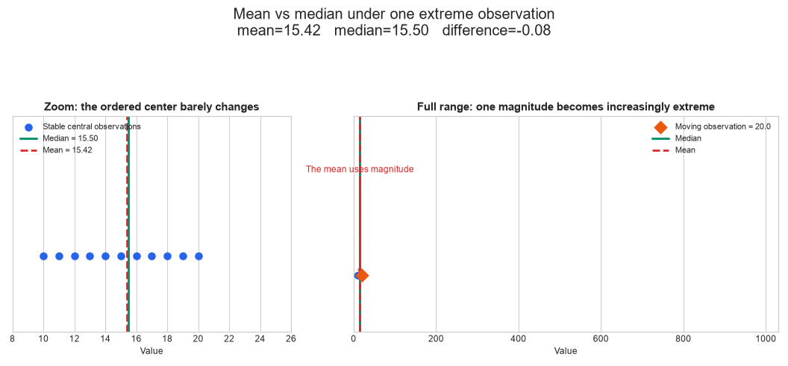
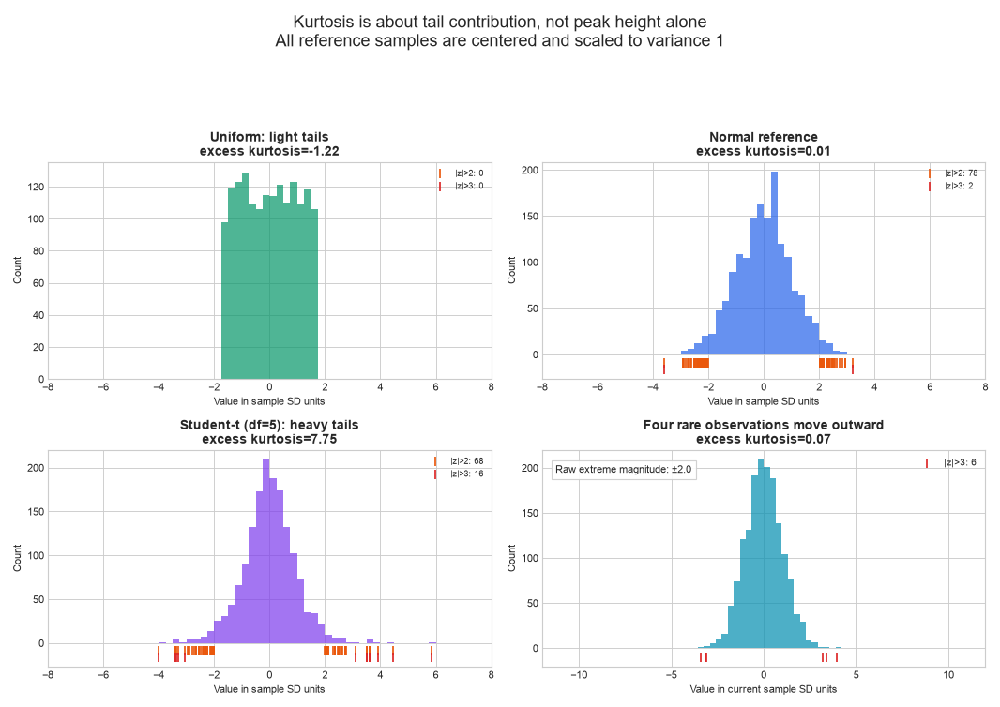
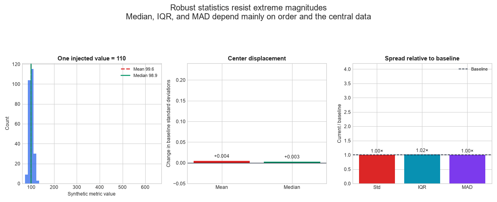
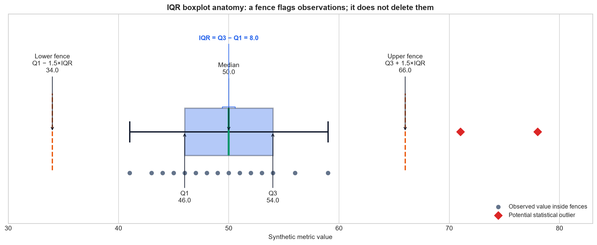
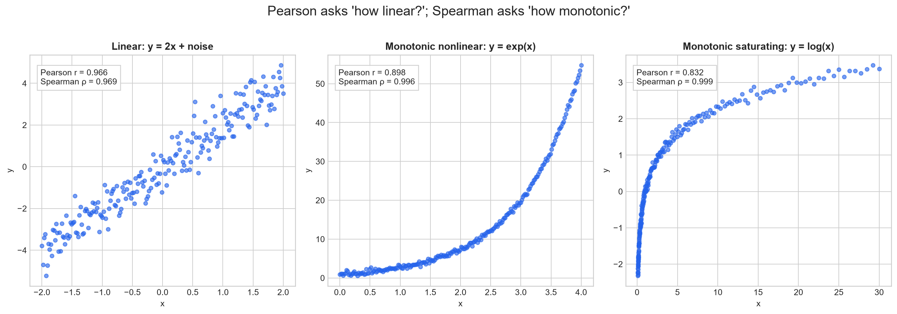
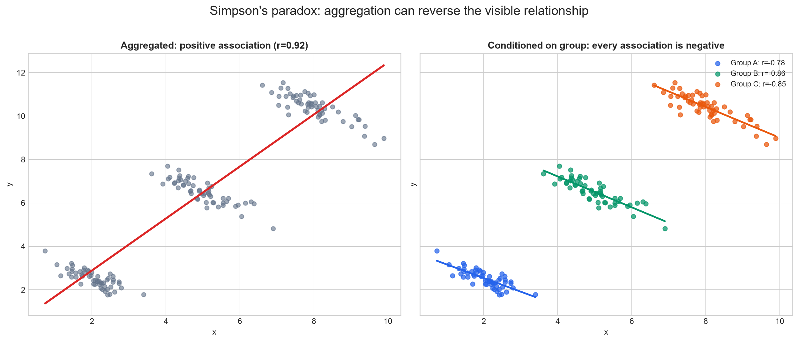
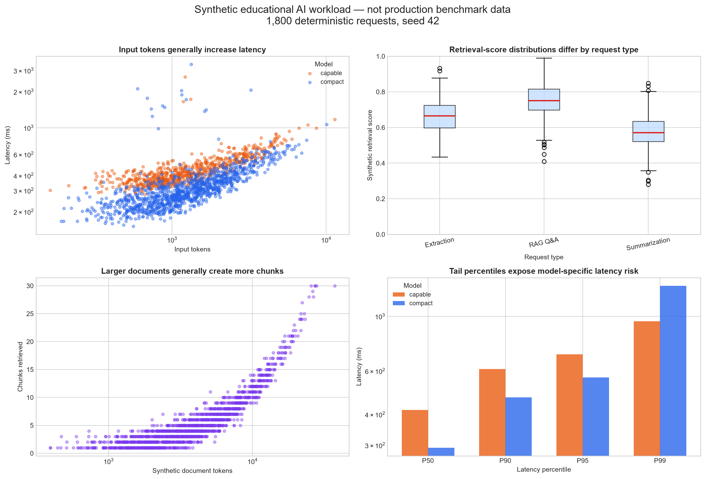
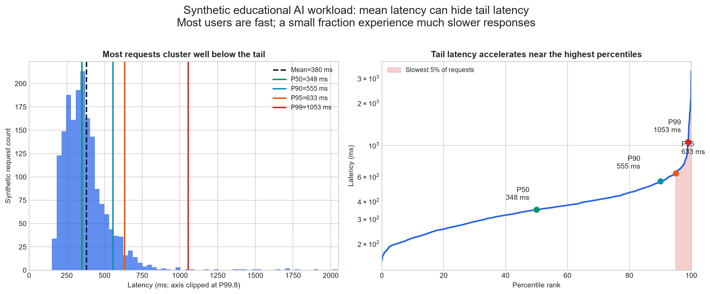

# Exploratory Data Analysis with Statistical Rigor

## Overview

Exploratory Data Analysis (EDA) is the disciplined characterization of data
quality, empirical distributions, unusual observations, and relationships
before modeling or operational decisions. A statistic is a compressed view of
the data: its usefulness depends on the distribution, estimator convention,
sampling process, and question being asked.

This study connects classical descriptive statistics to an AI inference
workload. All data in the executable example is **synthetic and
deterministically generated**; it is not a production dataset or benchmark.

## Concepts and decisions

| Question | Useful measures | Important caution |
|---|---|---|
| Where is the distribution centered? | Mean, median | The mean is sensitive to extreme values |
| How dispersed is it? | Variance, standard deviation, IQR, MAD | State population/sample and quantile conventions |
| What is its shape? | Skewness, excess kurtosis, quantiles | A few observations can dominate higher moments |
| Which observations are unusual? | Domain rules, IQR fences, robust scores | A flag is not a deletion decision |
| How do variables move together? | Covariance, Pearson, Spearman | Correlation is neither causation nor a general independence test |

The implementation also demonstrates Bessel's correction, average ranks for
ties, tail-latency summaries, and a deterministic relationship whose Pearson
correlation is zero.

## Why it matters

In applied AI systems, the same reasoning applies to document length, chunk
counts, retrieval scores, input and output tokens, latency, request cost, and
evaluation scores. Global averages can hide tail risk, subgroup failures,
leakage, changing traffic composition, or upstream data-quality problems.

## Files

- [`notes.md`](notes.md): formulas, estimator conventions, assumptions,
  limitations, and an EDA decision workflow.
- [`example.py`](example.py): pandas-based analysis of a deterministic
  synthetic inference workload and a controlled latency-spike experiment.
- [`from_scratch.py`](from_scratch.py): educational implementations of center,
  spread, moments, IQR fences, and Pearson/Spearman correlation.
- [`visualizations/`](visualizations/): six independently executable visual
  generators, shared deterministic data utilities, and the master generator.
- [`tests/`](tests/): numerical, reproducibility, invalid-input, visual-data,
  and output-manifest tests.
- [`interview_questions.md`](interview_questions.md): senior-level questions
  tied to the implementation.
- [`references.md`](references.md): authoritative documentation and further
  reading.

## Visual Lab

The visual lab changes the underlying data while keeping each statistical
question explicit. It consolidates related ideas into multi-panel figures
rather than treating every metric as an isolated decorative chart.

| Visualization | Statistical question |
|---|---|
| Mean vs median animation | Why does one extreme magnitude pull the mean more than the median? |
| Variance and squared deviations | How does spread increase variance, and why are deviations squared? |
| Bessel-correction simulation | Why does the denominator \(n\) underestimate variance across repeated small samples? |
| Skewness animation | How does a longer right tail change mean, median, and sample skewness? |
| Kurtosis animation | Why is kurtosis driven by tail contribution rather than peak height alone? |
| IQR anatomy and Z-score comparison | What does a fence flag, and how do distribution assumptions change the result? |
| Robust-statistics animation | Which center and spread measures resist one extreme observation? |
| Covariance geometry | Which quadrant contributions make covariance positive or negative? |
| Pearson noise levels | How does scatter geometry map to a linear correlation coefficient? |
| Pearson vs Spearman | What differs between linear and monotonic association? |
| Nonlinear dependence | Why can Pearson correlation be zero for a deterministic relationship? |
| Leverage-point animation | How can one observation change correlation and the fitted line? |
| Confounding and Simpson's paradox | Why do association and aggregation not identify a causal mechanism? |
| Anscombe's Quartet | Why are summary statistics not substitutes for visualization? |
| AI workload dashboard and 3D explorer | How do tokens, chunks, retrieval scores, latency, model, and cost interact? |
| Tail-latency view | Why can the mean hide the slowest user experiences? |

Generate all 22 artifacts from the topic directory:

```powershell
python visualizations/generate_all.py
```

Or run one conceptual group:

```powershell
python visualizations/central_tendency.py
python visualizations/dispersion.py
python visualizations/distribution_shape.py
python visualizations/outliers.py
python visualizations/correlation.py
python visualizations/interactive_eda.py
```

Outputs are written to:

```text
outputs/
├── images/       # 14 static PNGs
├── gifs/         # 6 bounded Pillow animations
└── interactive/  # 2 standalone Plotly HTML files
```

Open `outputs/interactive/ai_workload_3d.html` or
`outputs/interactive/distribution_explorer.html` directly in a browser. Plotly
is embedded in each file, so no server, notebook, credentials, or network call
is required.

The synthetic AI workload contains 1,800 deterministic requests generated with
seed 42. Its magnitudes and injected relationships are educational; they are
not production measurements or benchmark claims. The code explicitly uses
population or sample conventions (`ddof=0` or `ddof=1`) and labels pandas'
bias-corrected sample skewness and excess kurtosis where relevant.

### Selected public previews

















These eight previews are intentionally selected as public Git candidates. The
other generated PNGs and GIFs are reproducible local artifacts, while the
approximately 4.8 MB standalone HTML files remain ignored because they embed
Plotly for offline use.

### Generated visual evidence

- **Hypotheses:** using \(n\) for repeated small-sample variance estimates will
  be biased downward; grouping can reverse an aggregate association; and a
  right-tailed workload can have a substantially slower P99 than its mean or
  median suggests.
- **Configuration:** deterministic seed 42; 4,000 IID samples of size 5 for the
  Bessel-correction panel; three synthetic groups of 55 observations for
  Simpson's paradox; and 1,800 synthetic AI requests for latency analysis.
- **Observed results:** the population variance was 226.240, while the mean
  repeated estimates were 178.251 with `ddof=0` and 222.814 with `ddof=1`.
  Simpson's aggregate correlation was 0.921, while within-group correlations
  were -0.781, -0.856, and -0.850. Synthetic latency had mean 379.836 ms,
  P50 348.379 ms, P95 633.357 ms, and P99 1,053.429 ms.
- **Interpretation:** the generated panels are consistent with the
  estimator-bias, aggregation, and tail-risk concepts they were designed to
  expose.
- **Limitations:** every dataset is constructed for education. The values do
  not establish production thresholds, effect sizes, causal conclusions, or
  benchmark performance.

## Run

From the repository root, install the shared dependencies if needed:

```bash
python -m pip install -e ".[dev]"
```

Run both educational paths:

```bash
python 00-foundations/09-exploratory-data-analysis/from_scratch.py
python 00-foundations/09-exploratory-data-analysis/example.py
```

Run the focused tests:

```bash
python -m unittest discover \
  -s 00-foundations/09-exploratory-data-analysis/tests \
  -p "test_*.py"
```

## Executed experiment record

The practical example was executed with the current source configuration.

- **Hypothesis:** five large latency spikes will change non-robust and
  tail-sensitive summaries more than the median.
- **Configuration:** 1,000 synthetic requests, NumPy random generator seed 42,
  identical baseline and treatment workloads, and additive spikes of 1,500,
  1,800, 2,200, 2,600, and 3,000 ms in the treatment.
- **Observed result:** mean latency changed from 278.449 to 289.549 ms; median
  from 269.210 to 269.306 ms; sample standard deviation from 78.392 to 177.706
  ms; P99 from 530.352 to 596.947 ms; and excess kurtosis from 3.501 to
  155.293.
- **Interpretation:** the controlled result
  is consistent with the hypothesis and illustrates why median plus tail
  quantiles can communicate this workload better than its mean alone.
- **Limitation:** the generator and injected spikes were chosen for education.
  They do not estimate a real service distribution, establish operational
  thresholds, or support a benchmark claim.

## Key takeaways

- Report center and spread measures that fit the distribution, often in
  complementary robust and non-robust pairs.
- Specify `ddof`, skewness/kurtosis bias correction, excess-kurtosis, quantile,
  and missing-value conventions when results must be reproduced.
- Investigate potential outliers using domain and data-lineage context before
  changing or removing them.
- Pearson measures linear association; Spearman measures monotonic association;
  neither proves causality or detects every dependency.
- Segment by relevant populations and respect prediction-time boundaries:
  aggregate EDA can hide subgroup problems and leakage.
