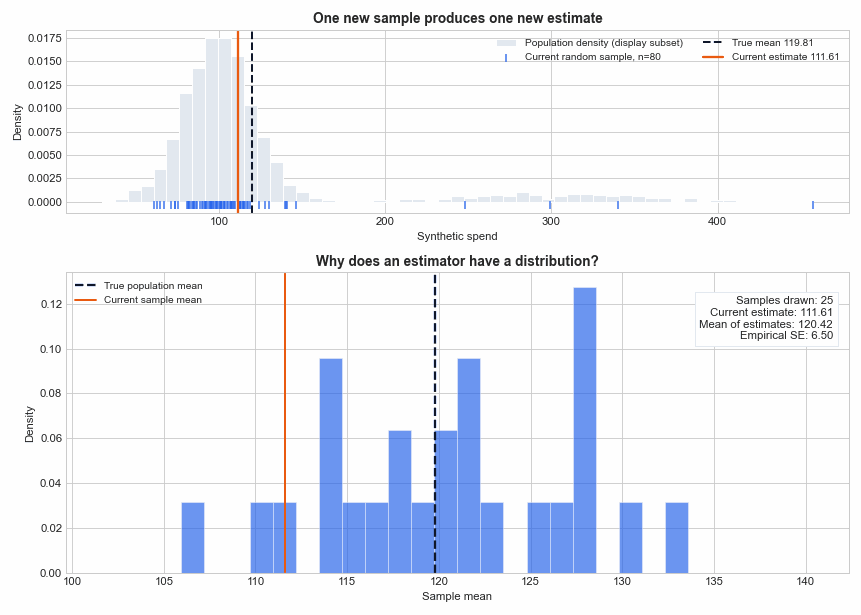
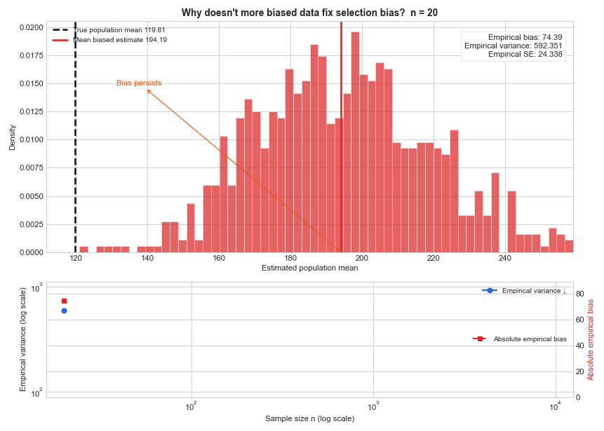
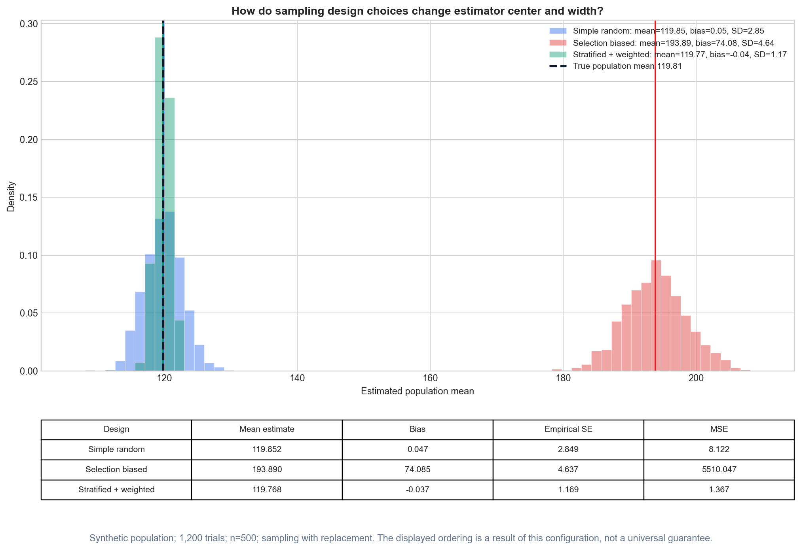
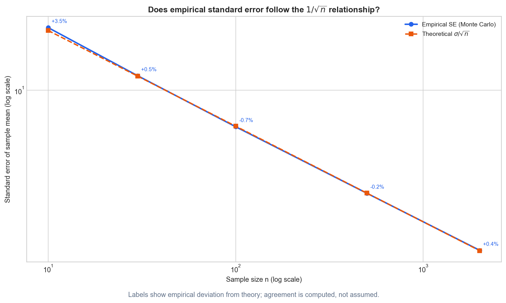

# Sampling, Bias, and Variance

## Overview

Sampling connects a target population to the data used for estimation,
evaluation, and model development. The sample size controls only part of the
uncertainty: a larger sample can stabilize an estimate while leaving systematic
selection error untouched.

This study separates three ideas that are often conflated:

- **sampling bias**: the observed units do not represent the target population;
- **estimator bias**: an estimator's expectation differs from its target
  parameter under the assumed sampling process;
- **estimator variance**: repeated samples produce different estimates.

The executable example uses a **deterministically generated synthetic finite
population**. It is an educational experiment, not a public dataset or a
benchmark.

## The technical question

Suppose regular and premium customers have different spending distributions.
What happens to an estimated population mean when samples are drawn by:

1. simple random sampling;
2. a mechanism that makes premium customers eight times as likely to be
   selected;
3. equal allocation to both segments followed by weighting with their true
   finite-population shares?

Repeated sampling makes each design's bias and variance observable. The
example also checks the empirical identity

\[
\operatorname{MSE}(\hat\theta)
= \operatorname{Var}(\hat\theta)
+ \operatorname{Bias}(\hat\theta)^2.
\]

## Why it matters in applied AI

A representative production sample, a balanced diagnostic benchmark, and a
rare-failure test suite answer different questions. Treating them as
interchangeable can distort offline metrics for classifiers, RAG systems, LLM
evaluations, document-processing pipelines, or production monitoring.

The unit of sampling matters too. A million rows from two thousand users are
not necessarily a million independent observations. Group and temporal
boundaries should follow the deployment question rather than a convenient
row-level split.

## Files

- [`notes.md`](notes.md): sampling designs, formulas, assumptions, weighting,
  dependence, applications, and failure modes.
- [`example.py`](example.py): repeated-sampling comparison on the synthetic
  two-segment population.
- [`from_scratch.py`](from_scratch.py): educational bias, variance, MSE,
  weighted-mean, effective-sample-size, and finite-population formulas.
- [`visual_lab.py`](visual_lab.py): command-line generator for the complete
  static, animated, and standalone interactive laboratory.
- [`visualizations/`](visualizations/): reusable simulation, rendering, and
  numerical-validation modules for thirteen visual experiments.
- [`tests/`](tests/): formula, validation, reproducibility, experimental-design,
  and visual-manifest tests.
- [`interview_questions.md`](interview_questions.md): senior-level conceptual
  and production questions.
- [`references.md`](references.md): authoritative documentation and further
  reading.

## Run

From the repository root, install the shared dependencies if needed:

```bash
python -m pip install -e ".[dev]"
```

Run both educational paths:

```bash
python 00-foundations/10-sampling-bias-variance/from_scratch.py
python 00-foundations/10-sampling-bias-variance/example.py
```

Run the focused tests:

```bash
python -m pytest -q 00-foundations/10-sampling-bias-variance/tests
```

## Visual Lab

The visual laboratory asks one statistical question per asset. It uses only
deterministic synthetic data and runs without a notebook, API, credential, or
external dataset.

| Visual question | Output |
|---|---|
| How does one sample become one estimate? | `population_vs_samples.png` |
| Why does an estimator have a sampling distribution? | `sampling_distribution.gif` |
| How does sample size change estimator spread? | `sample_size_distributions.png` |
| Does empirical SE follow \(\sigma/\sqrt n\)? | `sample_size_vs_standard_error.png` |
| Why does more biased data become precisely wrong? | `more_biased_data.gif` |
| How do estimator center and spread encode bias and variance? | `bias_variance_target.png` |
| How do squared bias and variance combine into MSE? | `mse_bias_variance_heatmap.png` and `mse_bias_variance_surface.html` |
| How do random, selection-biased, and stratified designs differ? | `sampling_strategy_comparison.png` |
| Why must deliberate oversampling be weighted? | `why_weighting_matters.png` |
| How does weight concentration reduce effective sample size? | `effective_sample_size.png` |
| Why are repeated rows not independent information? | `correlated_observations.png` |
| How can row-level splitting leak user identity? | `group_split_vs_random_split.png` |
| Why can random samples miss rare failures? | `rare_event_sampling.gif` |
| Why do balanced and production-weighted LLM evaluations answer different questions? | `llm_evaluation_sampling.png` |
| How do sample size and selection strength change sampling distributions? | `sampling_explorer.html` |

Generate all 16 assets from the repository root:

```bash
python 00-foundations/10-sampling-bias-variance/visual_lab.py
```

Generate one conceptual group:

```bash
python 00-foundations/10-sampling-bias-variance/visual_lab.py --experiment sampling
python 00-foundations/10-sampling-bias-variance/visual_lab.py --experiment sample-size
python 00-foundations/10-sampling-bias-variance/visual_lab.py --experiment bias
python 00-foundations/10-sampling-bias-variance/visual_lab.py --experiment stratified
python 00-foundations/10-sampling-bias-variance/visual_lab.py --experiment weighting
python 00-foundations/10-sampling-bias-variance/visual_lab.py --experiment clusters
python 00-foundations/10-sampling-bias-variance/visual_lab.py --experiment rare-events
python 00-foundations/10-sampling-bias-variance/visual_lab.py --experiment llm-evaluation
python 00-foundations/10-sampling-bias-variance/visual_lab.py --experiment interactive
```

Outputs are written to:

```text
outputs/
├── static/       # 11 PNG files
├── gifs/         # 3 Pillow-backed animations
└── interactive/  # 2 standalone Plotly HTML files
```

The interactive files embed Plotly and open locally in a browser without a
server. The sampling explorer uses reproducible precomputed scenarios because
standalone HTML cannot execute Python when a control changes.

### Selected public previews









These four assets are intentionally selected as public Git candidates because
they expose the topic''s core mechanisms. The other generated PNGs and GIF are
reproducible local artifacts. Both standalone HTML files remain ignored: each
is approximately 4.9 MB because Plotly is embedded for offline use.

### Executed visual evidence

The complete visual lab was executed with the current source configuration.

- **Hypotheses:** representative sampling will center estimates near the
  target; estimator SE will shrink approximately as \(1/\sqrt n\); increasing
  a selection-biased sample will reduce variance without removing its center
  displacement; population weighting will reconstruct an intentionally
  oversampled population aggregate; and positive within-user dependence will
  reduce the information represented by a fixed row count.
- **Configuration:** synthetic population of 50,000 observations with seed 42;
  1,200 repeated samples for the sample-size and strategy panels; sampling
  with replacement where the visual compares against \(\sigma/\sqrt n\);
  sample sizes 10, 30, 100, 500, and 2,000 for SE; biased sample sizes 20 to
  10,000 with premium selection weight 8; 800 repeated datasets for the
  dependence panel; 1% rare-event prevalence; and a synthetic 180-user Ridge
  regression used only to expose split leakage.
- **Observed results:** empirical SE values for \(n=10,30,100,500,2000\) were
  21.2410, 11.9053, 6.4415, 2.8956, and 1.4568; their theoretical values were
  20.5157, 11.8447, 6.4876, 2.9014, and 1.4507. In the strategy comparison,
  empirical biases were 0.0470 for simple random, 74.0847 for selection-biased,
  and -0.0373 for weighted stratified sampling; variances were 8.1196,
  21.5029, and 1.3659. For biased sampling, variance fell from 592.3510 at
  \(n=20\) to 1.1698 at \(n=10{,}000\), while empirical bias remained between
  73.46 and 74.39. Equal weights produced ESS 100.0000; one weight of 100 with
  99 weights of 1 produced ESS 3.9213. With configured intraclass correlation
  0.8621, empirical SE was 0.2650 for 10,000 independent rows and 2.5268 for
  100 users repeated 100 times. Row-split and group-split MAE were 4.8666 and
  25.3428. Among 1,000 random samples of 50 from a 1% rare-event population,
  60.5% contained no rare event. Constructed LLM category scores aggregated to
  0.7725 under balanced diagnostic weights and 0.8715 under production weights.
- **Interpretation candidate for author review:** the generated results are
  consistent with the mechanisms the lab was designed to expose. In this
  configuration, stratification removed segment-composition noise; increasing
  biased sample size stabilized the wrong estimand; unequal weights sharply
  reduced ESS; and repeated-user dependence and identity leakage made nominal
  row count and row-level evaluation optimistic summaries of independent
  information and unseen-user generalization.
- **Limitations:** every magnitude and relationship is constructed. Sampling
  with replacement is a modeling choice in several panels; the two-stratum
  design uses known population shares; Kish ESS does not capture every complex
  design; the clustered generator fixes one ICC; the identity-only Ridge model
  is deliberately artificial; and the LLM/RAG scores are illustrations, not
  measurements or benchmark claims.

## Executed experiment record

The practical example is deterministic, but its results remain evidence about
the configured synthetic population only.

- **Hypothesis:** representative random and correctly weighted stratified
  sampling will be approximately centered on the finite-population mean;
  preferential selection of the higher-spending segment will shift the
  sampling distribution; and equal-allocation stratification will reduce
  variance for this constructed two-segment population.
- **Configuration:** synthetic finite population of 50,000 observations,
  empirical premium share 0.0998, population mean 119.8054, population seed
  42, experiment seed 2024, 500 repeated samples of size 400 without
  replacement, premium selection multiplier 8.0, and a stratified allocation
  of 200 regular plus 200 premium observations weighted by empirical
  population shares. Empirical sampling-distribution variance uses `ddof=0`.
- **Observed result:** simple random sampling had mean estimate 120.1072, bias
  0.3018, variance 9.6531, and MSE 9.7442; selection-biased sampling had mean
  192.8717, bias 73.0663, variance 28.9879, and MSE 5,367.6719; weighted
  stratified sampling had mean 119.8560, bias 0.0507, variance 1.8122, and MSE
  1.8148. For every design, the computed MSE matched variance plus squared bias
  to displayed precision.
- **Interpretation candidate for author review:** the result is consistent
  with the hypothesis. Preferentially selecting the higher-spending segment
  made the estimate systematically high, whereas weighting the deliberately
  balanced sample by population shares recovered the target and reduced
  empirical variance for this constructed population.
- **Limitation:** the segment shares, spending distributions, and selection
  mechanism are constructed. They do not model unknown inclusion
  probabilities, non-response, temporal drift, annotation error, complex
  survey designs, or production performance.

## Key takeaways

- More independent observations can reduce variance; more observations from a
  biased mechanism do not automatically remove bias.
- An estimator is unbiased only relative to a target and an assumed sampling
  process.
- Stratified oversampling requires population weights when the goal is a
  population aggregate rather than a balanced diagnostic score.
- Unequal weights can correct representation while reducing effective sample
  size and increasing variance.
- Row count is not the same as independent information; sample, split, and
  resampling units must reflect dependence and time.
- Data quality includes coverage, selection, labels, measurement, lineage, and
  fitness for the decision—not merely dataset size.
