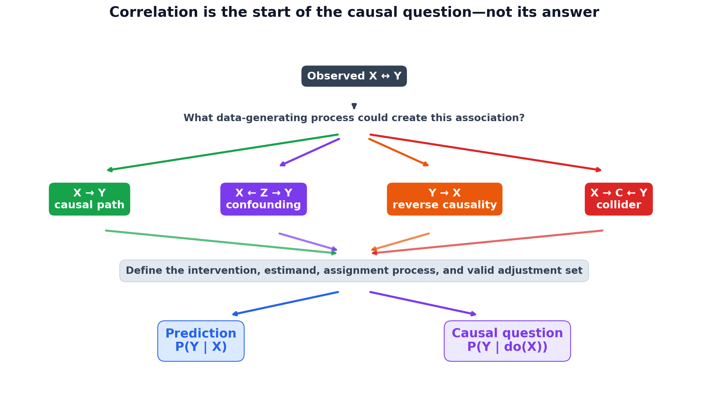

# Correlation vs Causation

## Overview

Correlation describes how variables vary together. Causation asks how an
outcome would change under an intervention. The observational quantity

\[
P(Y \mid X=x)
\]

is generally different from the interventional quantity

\[
P(Y \mid do(X=x)).
\]

The difference matters whenever an analysis will support a decision: enabling
an AI feature, changing retrieval depth, reducing latency, targeting an offer,
or deploying a model. Historical association can be useful for prediction
without identifying what will happen when the system changes.

This topic develops that distinction through deterministic synthetic examples.
They make the data-generating process known, so a regression estimate can be
compared with the coefficient used to construct the outcome. That controlled
demonstration is educational evidence, not validation of causal conclusions
from observational production data.

## Concepts and relevance

- Pearson correlation measures linear association; Spearman correlation
  measures monotonic rank association; Kendall's tau measures rank
  concordance.
- A zero Pearson correlation does not rule out a nonlinear relationship.
- Confounding creates a backdoor association when a common cause affects both
  treatment and outcome.
- Reverse causality, shared time trends, multiple testing, aggregation, and
  selection can produce misleading associations.
- A mediator lies on a causal path; a collider is a common effect. Blindly
  controlling for either can change the estimand or introduce bias.
- Regression estimates conditional association. A causal interpretation
  requires an estimand, a defensible design, and identification assumptions.
- Randomization breaks systematic treatment-confounder association in
  expectation, making treatment-group comparisons much easier to interpret.

In Applied AI, these ideas separate telemetry questions from intervention
questions. For example, requests with larger RAG `top_k` may differ in query
difficulty or routing policy. The observed relationship with answer quality
does not, by itself, estimate the effect of deliberately changing `top_k`.

## Files

- [`notes.md`](notes.md): causal graphs, correlation measures, potential
  outcomes, omitted-variable bias, assumptions, and common causal traps.
- [`example.py`](example.py): deterministic synthetic demonstrations of
  confounding, random assignment, nonlinear dependence, and collider
  conditioning.
- [`from_scratch.py`](from_scratch.py): validated educational implementations
  of Pearson correlation, ordinary least squares, residualization, and partial
  correlation.
- [`day13_visual_causality.py`](day13_visual_causality.py): ten visual
  experiments, four purposeful animations, an interactive 3D confounder view,
  and a compact causal-reasoning map.
- [`tests/`](tests/): formula, validation, reproducibility, causal-trap, and
  full visual-generation smoke checks.
- [`interview_questions.md`](interview_questions.md): senior-level conceptual
  and Applied AI questions.
- [`references.md`](references.md): primary literature, documentation, and
  further study.

## Run

From the repository root, install the shared dependencies if needed:

```bash
python -m pip install -e .[dev]
```

Run the educational implementation and the synthetic experiments:

```bash
python 00-foundations/13-correlation-causation/from_scratch.py
python 00-foundations/13-correlation-causation/example.py
```

Run the focused tests:

```bash
python -m pytest -q 00-foundations/13-correlation-causation/tests
```

Run the full visual lab:

```bash
python 00-foundations/13-correlation-causation/day13_visual_causality.py
```

Optional flags support an alternate directory, seed, reduced-cost smoke render,
or interactive display:

```bash
python 00-foundations/13-correlation-causation/day13_visual_causality.py --output-dir path/to/visuals --seed 42
python 00-foundations/13-correlation-causation/day13_visual_causality.py --quick
python 00-foundations/13-correlation-causation/day13_visual_causality.py --show
```

The numerical scripts print to the console and create no files. The visual lab
writes to `visuals/`. Everything uses explicitly synthetic or code-defined
data and requires no network access, credentials, external APIs, or datasets.

## Visual learning lab



The generator uses NumPy, Matplotlib, SciPy, Plotly, and Pillow. These are in
the repository environment. A standalone minimal installation is:

```bash
python -m pip install numpy matplotlib scipy plotly pillow
```

Each asset answers a specific question:

| Output | Visual question |
|---|---|
| `01_correlation_types.png` | When do Pearson and Spearman agree, diverge, or miss dependence? |
| `02_zero_correlation_nonlinear.gif` | How can a linear relationship turn into obvious dependence while Pearson approaches zero? |
| `03_confounded_relationship.png` | How does customer intent structure the exposure-outcome scatter hidden in a plain 2D view? |
| `04_confounder_3d.html` | What becomes visible when intent is restored as a third axis and an adjusted plane? |
| `05_naive_vs_adjusted.png` | How do the known, omitted-variable, and adjusted coefficients compare in the constructed model? |
| `06_omitted_variable_bias.gif` | How does the naive coefficient move as treatment-confounder association increases? |
| `07_simpsons_paradox.png` | How can aggregation reverse both within-group relationships? |
| `08_collider_bias.png` and `.gif` | How can selection create and strengthen association between otherwise independent causes? |
| `09_observation_vs_intervention.gif` | Which incoming causal edge is removed by `do(X=x)`? |
| `10_rag_observation_vs_intervention.png` | Why is production telemetry about `top_k` different from randomized assignment? |
| `causal_inference_visual_summary.png` | Which data-generating structures should be considered before making a causal claim? |

Only the compact summary is intentionally versioned as a public README
preview. The detailed PNGs, GIFs, and self-contained Plotly HTML remain ignored
regenerable artifacts. The HTML embeds Plotly and does not need Kaleido or a
running Python server.

### Executed visual evidence

The full-resolution generator was executed with the checked-in source.

- **Hypotheses:** rank and linear correlations should respond differently to
  relationship shape and outliers; a hidden common cause should bias the naive
  treatment coefficient; increasing treatment-confounder association should
  move that coefficient; aggregation should reverse the configured subgroup
  slopes; selecting on a common effect should induce association; and
  randomized RAG `top_k` should be approximately independent of query
  complexity.
- **Configuration:** seed 42; 180 points per correlation panel; 800 points and
  22 frames for the nonlinear transition; 2,000 observations in the main
  confounding example; 1,000 observations and 20 treatment-confounder
  correlations from 0 to 0.9 for omitted-variable bias; 900 observations for
  Simpson's paradox; 6,000 skill pairs with selection above the 75th percentile
  and 18 animated thresholds for collider bias; 14 configured transition steps
  for graph surgery;
  and 2,500 synthetic RAG requests.
- **Observed results:** the nonlinear transition moved Pearson correlation from
  0.992 to -0.036. In the confounded advertising data, raw correlation was
  0.919; the naive and adjusted exposure coefficients were 4.335 and 2.090 for
  a known effect of 2.000. Across the bias animation, the naive coefficient
  moved from 1.920 to 6.492 while the adjusted coefficient moved from 1.959 to
  1.906. Simpson slopes were 0.820 in aggregate, -0.646 for low-intent users,
  and -0.637 for high-intent users. Skill correlation was -0.010 in the source
  population and -0.524 among 1,500 selected candidates; across animated
  thresholds it moved from -0.322 to -0.613. In the RAG example, the known
  `top_k` effect was 1.200, the observational slope was -1.552, the randomized
  slope was 1.153, and correlation between randomized `top_k` and complexity
  was 0.014.
- **Interpretation candidate for author review:** the rendered results are
  consistent with correlation being sensitive to relationship shape,
  omitted-variable bias increasing with treatment-confounder association,
  aggregation reversing subgroup patterns, collider conditioning creating
  association, and randomized assignment answering a different question from
  observational telemetry.
- **Limitations:** every graph, coefficient, noise distribution, group
  separation, selection threshold, and RAG quality equation is constructed.
  The adjusted estimate is close to the known coefficient because the relevant
  confounder is observed, overlap is adequate, the linear form is appropriate,
  and hidden confounding is absent by design. The visuals do not validate a
  causal effect, metric, treatment policy, or deployment decision in a real
  advertising or AI system.

## Executed experiment record

The checked-in scripts were executed with the following record. Results apply
only to the constructed models.

- **Hypotheses:** an omitted common cause should bias the exposure coefficient;
  a strong association can remain when the constructed exposure effect is
  zero; random assignment should remove systematic confounding; the
  deterministic relationship \(Y=X^2\) can have zero Pearson correlation;
  and selecting on a common effect should induce association between its
  otherwise independent causes.
- **Configuration:** seed 42; 5,000 observations per advertising scenario;
  `exposure = 1.5 * intent + noise` when observational;
  `purchase = true_effect * exposure + 5 * intent + noise`; true exposure
  effects 2, 0, and 2 for the confounded-effect, confounded-zero-effect, and
  randomized scenarios; 5,000 symmetric points for \(Y=X^2\); and 20,000
  independent skill pairs with selection above the 75th percentile of a noisy
  additive hiring score.
- **Observed results:** the confounded true-effect scenario had correlation
  0.912, naive coefficient 4.302, and intent-adjusted coefficient 2.028. With a
  zero true effect, correlation was 0.766, the naive coefficient was 2.302,
  and the adjusted coefficient was 0.028. Under randomized exposure, the naive
  and adjusted coefficients were 1.863 and 2.028 for a true effect of 2. The
  \(X\) versus \(X^2\) Pearson correlation printed as -0.000000. Independent
  skills had population correlation -0.003; among the selected 5,000 cases,
  their correlation was -0.522.
- **Interpretation candidate for author review:** within these deliberately
  specified equations, the outputs are consistent with omitted-variable bias,
  randomization removing the treatment-confounder link, Pearson missing
  symmetric nonlinear dependence, and selection on a collider creating an
  association.
- **Limitations:** the causal graph, functional form, observed confounder,
  coefficients, noise distributions, selection rule, and seed are all chosen
  by construction. Adjustment works here because the relevant common cause is
  observed and the linear model matches the generator. The examples do not
  establish identification, transportability, treatment compliance, adequate
  overlap, measurement validity, or an effect in any real system.

## Key takeaways

- Association asks what co-occurs; causality asks what changes under an
  intervention.
- No correlation coefficient, regression algorithm, feature-importance score,
  or predictive accuracy metric establishes causal direction by itself.
- Decide whether a variable is a confounder, mediator, collider, or
  post-treatment measurement before adjusting for it.
- Simpson's paradox signals that aggregation matters, but the causal graph and
  estimand determine which comparison is relevant.
- Prefer randomized experiments when feasible. For observational studies,
  state the causal question, graph, adjustment set, assumptions, diagnostics,
  and sensitivity analyses explicitly.
