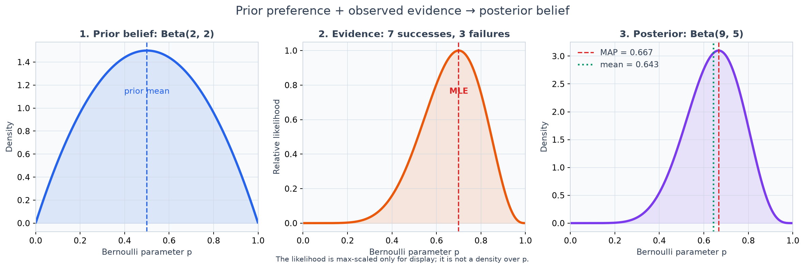

# Maximum Likelihood Estimation and MAP

## Overview

Maximum Likelihood Estimation (MLE) chooses parameters that make fixed,
observed data most compatible with an assumed probabilistic model. Maximum A
Posteriori estimation (MAP) instead chooses the mode of the posterior after
combining that likelihood with a parameter prior.

This distinction connects statistical estimation directly to model training.
Gaussian residual assumptions lead to squared-error objectives, Bernoulli and
categorical models lead to cross-entropy, and explicit Gaussian or Laplace
parameter priors lead to L2- or L1-type penalties. These connections hold only
with the relevant modeling assumptions and objective scaling made explicit.

## Concepts and relevance

- Probability varies observations with parameters fixed; likelihood compares
  parameters after the observations are fixed.
- Log-likelihood converts products into sums and avoids multiplying many small
  probabilities.
- MLE minimizes negative log-likelihood (NLL); MAP minimizes NLL plus negative
  log-prior.
- A Beta prior is conjugate to a Bernoulli likelihood, giving a closed-form
  posterior and, when it is unique, a closed-form posterior mode.
- A Gaussian prior over logistic-regression slopes adds a quadratic penalty.
  Its strength depends on whether the complete objective is summed or averaged.
- MAP remains a point estimate. It does not preserve posterior uncertainty and
  is not a substitute for full Bayesian inference.
- Model misspecification, leakage, non-identifiability, and optimization
  failure remain possible under both MLE and MAP.

In Applied AI, the same logic underlies binary classifiers and autoregressive
next-token training: minimizing cross-entropy is conditional
maximum-likelihood training when the output model is Bernoulli or categorical.
A likelihood interpretation explains the assumptions behind a loss; it does
not guarantee calibration, causal validity, or good out-of-distribution
behavior.

## Files

- [`notes.md`](notes.md): derivations, assumptions, objective scaling,
  regularization, limitations, and proposed follow-up experiments.
- [`example.py`](example.py): analytical and grid-based Beta-Bernoulli MLE/MAP
  comparisons in log space.
- [`from_scratch.py`](from_scratch.py): stable NumPy logistic-regression MLE and
  Gaussian-prior MAP optimization on deterministic synthetic data.
- [`mle_map_visual_lab.py`](mle_map_visual_lab.py): offline Matplotlib
  figures, 3D surfaces, and GIF animations connecting likelihood geometry to
  model training and regularization.
- [`tests/`](tests/): formula, boundary, stability, finite-difference gradient,
  scaling, reproducibility, and shrinkage checks.
- [`interview_questions.md`](interview_questions.md): senior-level conceptual
  and implementation questions.
- [`references.md`](references.md): primary and authoritative further reading.

## Run

From the repository root, install the shared dependencies if needed:

```bash
python -m pip install -e .[dev]
```

Run the Bernoulli comparison and logistic-regression implementation:

```bash
python 00-foundations/14-maximum-likelihood-map/example.py
python 00-foundations/14-maximum-likelihood-map/from_scratch.py
```

Display one visual locally:

```bash
python 00-foundations/14-maximum-likelihood-map/mle_map_visual_lab.py --demo bernoulli
```

Generate an individual asset or the complete set:

```bash
python 00-foundations/14-maximum-likelihood-map/mle_map_visual_lab.py --demo accumulation --save
python 00-foundations/14-maximum-likelihood-map/mle_map_visual_lab.py --demo all --save
```

Run the focused tests:

```bash
python -m pytest -q 00-foundations/14-maximum-likelihood-map/tests
```

The two numerical scripts print to the console and create no files. The visual
lab writes assets only with `--save`; `--quick` reduces animation frames and
surface grids for smoke runs. All observations are
either analytically specified counts or deterministic synthetic data; no
external dataset, network access, credential, or pre-generated asset is
required.

## Visual learning lab



The lab follows one narrative: observations define likelihood; log-space makes
the objective practical; negative log-likelihood becomes a trainable loss; and
a parameter prior changes that geometry to produce MAP.

| Demo | Question answered | Output |
|---|---|---|
| `bernoulli` | How do probability and likelihood reverse what is fixed? | `01_probability_vs_likelihood.png` |
| `accumulation` | How does evidence concentrate relative likelihood? | [`likelihood_accumulation.gif`](assets/likelihood_accumulation.gif) |
| `log-space` | Why do likelihood, log-likelihood, and NLL share an optimum? | `03_log_likelihood.png` |
| `prior` | How do prior strength, likelihood, MAP, and posterior mean interact? | [`prior_likelihood_posterior.png`](assets/prior_likelihood_posterior.png), `05_prior_strength.png` |
| `sample-size` | How does a fixed prior's relative influence change with data? | `06_sample_size_effect.png` |
| `wrong-prior` | How can strong misspecified prior information hurt? | `07_wrong_prior.png` |
| `gaussian` | Why does fixed-variance Gaussian NLL produce squared error? | `08_gaussian_nll_vs_sse.png` |
| `bce` | Why is BCE the Bernoulli NLL? | `09_bce_curve.png` |
| `surface` | Where is logistic MLE on 2D and 3D NLL geometry? | [`logistic_surface.png`](assets/logistic_surface.png) |
| `optimization` | What does gradient descent optimize during training? | `mle_optimization.gif` |
| `map` | How does a Gaussian prior change the objective and solution? | [`mle_vs_map_surface.png`](assets/mle_vs_map_surface.png) |
| `prior-variance` | How does prior scale control coefficient shrinkage? | `13_prior_variance.png` |
| `uncertainty` | Why can equal MAP values hide different uncertainty? | `14_posterior_uncertainty.png` |
| `concept-map` | How do probabilistic assumptions connect to ML training? | `15_mle_map_concept_map.png` |

Only the four linked assets are intentionally versioned public previews. The
remaining PNGs and the optimization GIF are regenerable and ignored. No asset
is required to run the numerical examples.

## Executed visual evidence

The full visual lab was executed with the checked-in generator.

- **Hypotheses:** accumulating Bernoulli observations should concentrate
  relative likelihood; a fixed symmetric prior should become relatively less
  influential as evidence grows; a strong incorrect prior should dominate
  limited data; fixed-variance Gaussian NLL and SSE should have the same
  minimizer; Bernoulli NLL and BCE should be identical; gradient descent should
  lower logistic NLL; and a tighter zero-mean Gaussian prior should shrink the
  logistic slope.
- **Configuration:** seed 14; 100 Bernoulli draws from generator
  (p=0.7); Beta(2, 2) for the conjugate update; Beta(5, 5) across 1,000
  observations for sample-size behavior; misspecified Beta(20, 2) with
  generator (p=0.3); 55 Gaussian-regression observations with noise standard
  deviation 0.7; 80 observations for the full logistic surfaces; a Gaussian
  slope prior with standard deviation 0.75; 55 animated gradient steps; and
  prior-standard-deviation values 0.1, 0.5, 1, 2, and 10.
- **Observed results:** the accumulation sequence ended with 66/100 successes
  and MLE 0.660. Direct multiplication for 5,000 Bernoulli observations
  underflowed to 0 while summed log-likelihood remained -3054.322. The
  Beta(2, 2) example gave MLE 0.700, MAP 0.667, and posterior mean 0.643. With
  Beta(5, 5), the realized MLE/MAP pair at (n=1000) was 0.680/0.679. Under
  the incorrect Beta(20, 2) prior, MAP moved from 0.800 at (n=10) to 0.332 at
  (n=1000), while the final MLE was 0.320. Gaussian NLL and SSE selected the
  same grid slope, 1.858918, and the exactly rescaled curves differed by at
  most (2.84\times10^{-14}). Manual BCE and Bernoulli NLL both equaled
  4.039856376938. Logistic MLE was ((b,w)=(-0.413,2.216)); the
  Gaussian-prior MAP slope was 1.635. The animated mean NLL decreased from
  1.461 to 0.450. Across prior standard deviations from 0.1 to 10, absolute
  MAP slope increased from 0.201 to 2.210. The two uncertainty examples had
  the same MAP, 0.5, with visibly different posterior concentration.
- **Interpretation candidate for author review:** within these constructed
  models, the outputs are consistent with evidence concentrating likelihood,
  log-space preventing numerical underflow, explicit likelihood assumptions
  producing familiar losses, gradient descent navigating NLL geometry, and a
  Gaussian prior modifying that geometry toward smaller slopes.
- **Limitations:** all counts, distributions, seeds, grids, priors, and
  optimization settings are educational choices. One cumulative sample path
  does not show estimator variability; coefficient shrinkage does not imply
  better validation performance; fixed-prior dominance results assume regular
  identifiable models; MAP remains parameterization-dependent and does not
  retain posterior uncertainty; and explicit L2-style MAP should not be
  conflated with AdamW's decoupled update.

## Executed experiment record

- **Hypotheses:** with a fixed symmetric Beta prior and a constant empirical
  success rate, the MLE/MAP gap should decrease as sample size grows; in the
  constructed logistic model, decreasing Gaussian prior standard deviation
  should shrink the non-intercept coefficient norm.
- **Configuration:** the Bernoulli example used a Beta(2, 2) prior, counts of
  7/10, 70/100, 700/1,000, and 7,000/10,000, plus a 100,000-point grid on
  \([0.0001,0.9999]\). The logistic example used seed 14, 600 synthetic
  observations generated from weights `[-0.35, 1.4, -1.1, 0.65]`, the first
  450 rows for fitting, 150 for validation, and prior standard deviations
  `None`, 2.0, and 0.5. Batch gradient descent minimized the complete mean
  negative log-posterior while leaving the intercept unregularized.
- **Observed results:** for 7/10, analytical MLE was 0.700000 and MAP was
  0.666667; their grid modes were 0.699997 and 0.666663. Across the four sample
  sizes, the absolute MLE/MAP gap decreased from 0.033333 to 0.003922,
  0.000399, and 0.000040. Logistic slope norms were 2.004524 for MLE, 1.986029
  for MAP with \(\sigma=2.0\), and 1.765185 with \(\sigma=0.5\). Validation
  mean NLL values were 0.439507, 0.439467, and 0.440782; all three validation
  accuracies were 0.7933.
- **Interpretation candidate for author review:** these constructed outputs are
  consistent with a fixed prior becoming weaker relative to accumulating
  Bernoulli evidence and a tighter zero-mean Gaussian prior producing stronger
  logistic-coefficient shrinkage. The single validation split does not support
  a conclusion that either prior improves generalization.
- **Limitations:** the Bernoulli counts are specified and the logistic data are
  synthetic. The generator, seed, split, prior family, prior scales, and
  optimizer are chosen for illustration. One draw cannot estimate performance
  variability, the coefficient-generating values are not posterior truth, and
  these point estimates do not quantify posterior uncertainty or validate any
  production system.

## Key takeaways

- A loss function can encode a probability model, not just an optimization
  preference.
- A fixed prior has more relative influence with limited data; its effect often
  decreases as the likelihood accumulates under regular identifiable models.
- Gaussian-prior MAP and L2 regularization align only when parameter scope and
  sum-versus-mean scaling are handled consistently.
- A strong prior can stabilize an estimate or bias it; prior sensitivity is a
  modeling responsibility.
- MLE and MAP return point estimates inside a chosen model family. Neither
  quantifies the full posterior nor repairs a misspecified model.
