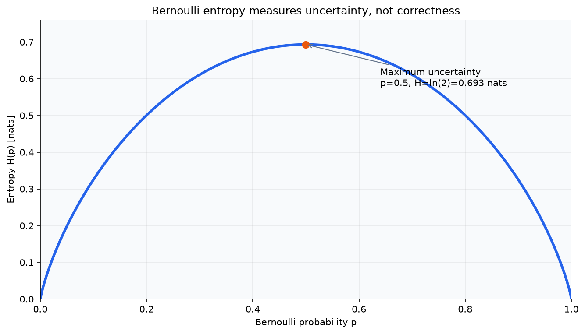
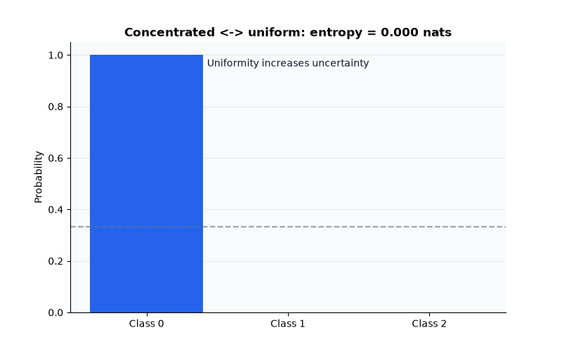
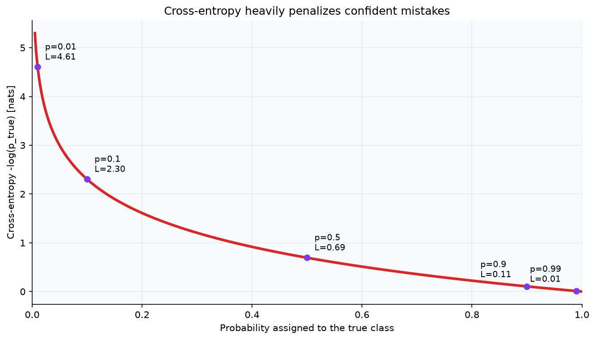
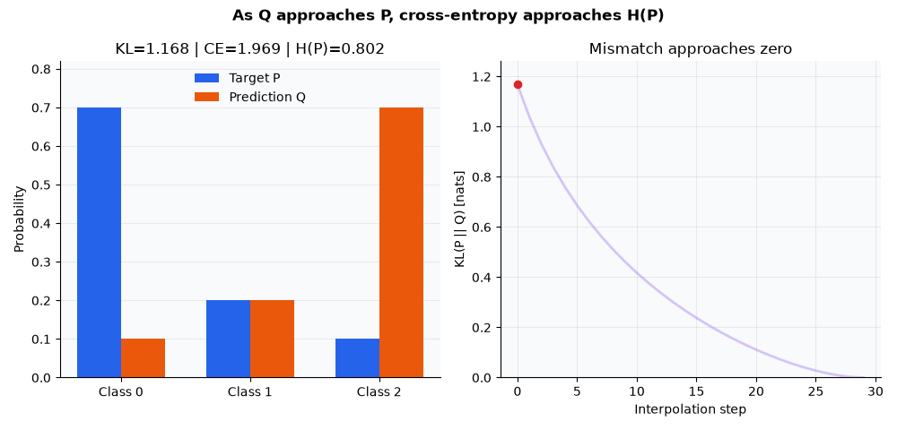
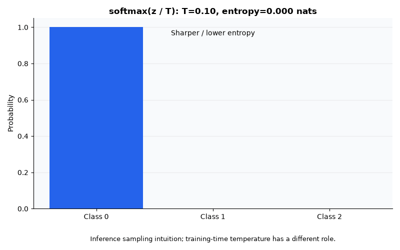
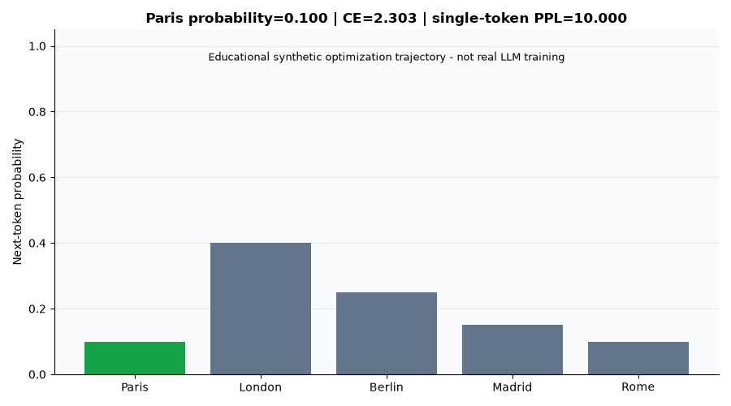

# Entropy, Cross-Entropy, and KL Divergence

## Overview

Entropy measures uncertainty within a probability distribution. Cross-entropy
measures the expected log loss when observations follow a target distribution
`P` but are encoded or predicted with a model distribution `Q`. Kullback-Leibler
(KL) divergence isolates the mismatch between those distributions:

$$
H(P,Q) = H(P) + D_{KL}(P\|Q).
$$

When `P` is fixed during supervised training, minimizing cross-entropy over
model parameters is therefore equivalent to minimizing forward KL divergence.
For one-hot categorical targets, the per-example loss reduces to the negative
log-probability of the observed class. This is also categorical negative
log-likelihood (NLL), connecting information theory to maximum likelihood.

## Concepts and relevance

- Self-information, entropy, cross-entropy, and KL divergence use logarithms to
  quantify surprise, uncertainty, and distribution mismatch.
- A one-hot classification target gives `CE = -log(q_y)`, so a confidently
  wrong prediction receives a much larger penalty than an uncertain one.
- KL divergence is non-negative but asymmetric and may be infinite. It is a
  divergence, not a distance metric.
- Stable log-softmax computes categorical loss from logits without first
  exponentiating potentially large values.
- Softmax with cross-entropy has the useful logit gradient `q - y`.
- Binary, multiclass, and multilabel tasks require different output and loss
  interpretations; categorical softmax is not interchangeable with independent
  Bernoulli outputs.
- Autoregressive language-model training repeats categorical NLL over valid
  next-token positions. Padding and context-only positions must be excluded.
- Perplexity is the exponential of mean token NLL when natural logarithms are
  used, but it is comparable only under compatible tokenization, data,
  conditioning, and masking.

These ideas appear in logistic regression, neural-network classifiers,
next-token language modeling, knowledge distillation, label smoothing,
variational inference, and policy regularization. A better training loss does
not by itself establish calibration, task utility, fairness, or production
quality; those require separate evaluation.

## Files

- [`notes.md`](notes.md): definitions, derivations, assumptions, numerical
  stability, KL direction, LLM loss construction, and limitations.
- [`from_scratch.py`](from_scratch.py): validated NumPy implementations of the
  three quantities, stable log-softmax, softmax, and masked categorical NLL.
- [`example.py`](example.py): deterministic, code-defined demonstrations of
  distribution mismatch, confident mistakes, and token-weighted LLM loss.
- [`visual_lab.py`](visual_lab.py): standalone Matplotlib animations and static
  figures plus self-contained Plotly explorations, organized by concept.
- [`assets/`](assets/): six curated PNG/GIF previews, one linked interactive
  HTML artifact, and additional locally regenerable outputs.
- [`tests/`](tests/): identities, edge cases, stability, masking, and input
  validation for the numerical core and visual generator.
- [`interview_questions.md`](interview_questions.md): senior-level questions
  connecting the mathematics to implementation and evaluation.
- [`references.md`](references.md): original and authoritative sources.

## Run

From the repository root, install the shared dependencies if needed:

```bash
python -m pip install -e .[dev]
```

Run the practical and first-principles examples:

```bash
python 00-foundations/15-entropy-cross-entropy-kl-divergence/example.py
python 00-foundations/15-entropy-cross-entropy-kl-divergence/from_scratch.py
```

Run the focused tests:

```bash
python -m pytest -q 00-foundations/15-entropy-cross-entropy-kl-divergence/tests
```

Generate the complete visual lab or one conceptual group:

```bash
python 00-foundations/15-entropy-cross-entropy-kl-divergence/visual_lab.py
python 00-foundations/15-entropy-cross-entropy-kl-divergence/visual_lab.py --only entropy
python 00-foundations/15-entropy-cross-entropy-kl-divergence/visual_lab.py --only kl
python 00-foundations/15-entropy-cross-entropy-kl-divergence/visual_lab.py --only softmax
python 00-foundations/15-entropy-cross-entropy-kl-divergence/visual_lab.py --only llm
```

The numerical scripts print to the console and create no files. The visual lab
creates `assets/` when needed and prints only paths it successfully generates.
Every probability, density, logit, target, and mask is code-defined synthetic
data selected to isolate a mathematical property. No public dataset, network
access, credentials, model download, or framework-specific runtime is required.

## Visual Intuition

The selected previews follow one connected story: uncertainty belongs to the
target distribution; cross-entropy adds model mismatch; logits become a
probability distribution; and the same categorical NLL appears at each valid
next-token position.

### Uncertainty peaks when outcomes are balanced



Bernoulli entropy is zero at deterministic endpoints and reaches `ln(2)` nats
at `p=0.5`. The curve describes uncertainty, not whether an outcome is correct.



This deterministic interpolation moves a point mass toward a three-class
uniform distribution and back. Entropy rises from zero toward `ln(3)` nats as
the distribution becomes less concentrated.

### Confidence and mismatch determine log loss



For a one-hot target, loss is `-log(p_true)`: assigning little probability to
the observed class is increasingly expensive.



As the constructed prediction `Q` approaches fixed target `P`, forward KL
approaches zero while cross-entropy approaches the constant `H(P)`. This is an
interpolation through distributions, not a learned optimization trajectory.

### Softmax temperature and next-token loss



For fixed logits, lower inference temperature sharpens the categorical
distribution and higher temperature flattens it. Training-time temperature in
distillation or calibrated objectives is a separate modeling decision.



The observed token `Paris` moves from probability `0.10` to `0.90`; its
single-token NLL and corresponding exponentiated loss fall. This is an
educational probability path, not real Transformer training.

### Interactive explorations

- [Information-theory probability playground](assets/information_theory_playground.html):
  use the dropdown to compare entropy, cross-entropy, and both KL directions
  across six predefined `P`/`Q` scenarios.

The selected HTML embeds Plotly for offline interaction and is intentionally
versioned because it is linked here. It is about 4.9 MB. The separate KL-simplex
and temperature HTMLs remain local, ignored, and reproducible from
`visual_lab.py`. The six embedded previews above are also versioned; other
generated PNGs and GIFs remain ignored.

## What the implementation makes explicit

The educational implementation validates probability distributions rather
than silently normalizing them. It uses the standard conventions `0 log 0 = 0`
and `0 log(0/q) = 0`, while returning infinity if `P` assigns positive mass to
an event that `Q` declares impossible. This preserves the theory; arbitrary
probability clipping would change the stated objective.

Categorical NLL accepts raw logits with arbitrary leading batch or sequence
dimensions. Its Boolean mask excludes padded positions before the mean is
computed, so longer and shorter sequences contribute through their valid token
counts rather than through an unweighted mean of sequence means.

These routines are transparent study implementations, not replacements for
framework loss functions, automatic differentiation, mixed-precision kernels,
or distributed training code.

## Executed numerical demonstration

- **Hypotheses:** the decomposition should hold for the selected distributions;
  reversing KL should change its value; a confident wrong prediction should
  incur greater cross-entropy than an uncertain wrong prediction; log-softmax
  should remain finite for logits near 1,000; and a masked padding position
  should not affect token-mean loss.
- **Configuration:** code-defined `P = [0.7, 0.2, 0.1]` and
  `Q = [0.6, 0.3, 0.1]`; wrong binary predictions `[0.49, 0.51]` and
  `[0.001, 0.999]` for class 0; logits `[1000, 999, 998]`; and a synthetic
  two-sequence, four-token-vocabulary batch with five valid targets and one
  masked padded position.
- **Observed results:** `H(P) = 0.801819`, `H(P,Q) = 0.828631`, and
  `D_KL(P||Q) = 0.026812` nats, with the decomposition check returning true.
  `D_KL(Q||P) = 0.029149` nats. The uncertain and confident wrong losses were
  `0.713350` and `6.907755` nats. Stable NLL for the large logits was
  `0.407606`. The five-valid-token mean was `0.406257` nats, perplexity was
  `1.501188`, and the masked position contributed zero.
- **Interpretation:** these constructed outputs are
  consistent with cross-entropy decomposing into target entropy plus forward
  KL, KL direction mattering, log loss penalizing confident mistakes, stable
  logit-space computation, and padding masks controlling token aggregation.
- **Limitations:** all arrays were chosen for demonstration; they are not draws
  from a real dataset, trained-model results, calibration evidence, or
  benchmarks. One small batch does not characterize an LLM, and its perplexity
  has no value for cross-model comparison.

## Executed visual evidence

- **Hypotheses:** Bernoulli uncertainty should peak at `p=0.5`; categorical
  entropy should increase toward a uniform distribution; decreasing
  `p_true` should increase one-hot cross-entropy; interpolating `Q` toward `P`
  should lower forward KL to zero; increasing temperature for fixed logits
  should flatten probabilities and increase entropy; and increasing a
  synthetic next-token target probability should lower NLL and single-token
  perplexity.
- **Configuration:** natural logarithms; 18 deterministic assets; fixed
  `P=[0.7,0.2,0.1]`; a KL path from `Q=[0.1,0.2,0.7]` to `P`; logits
  `[3,1,0]` over temperatures `0.1` to `5`; 30-frame classifier, KL, and token
  paths; a 46-frame entropy loop; a 36-frame temperature path; a 40-step
  positive ternary simplex; and a synthetic five-token vocabulary with
  `Paris` as the observed next token.
- **Observed results:** Bernoulli entropy reached `ln(2)=0.693` nats at
  `p=0.5`, while the three-class uniform distribution reached
  `ln(3)=1.099`. One-hot losses at `p_true=0.01` and `0.99` were `4.605170`
  and `0.010050` nats. The KL interpolation began with
  `D_KL(P||Q)=1.167546` and `H(P,Q)=1.969365`, then ended with KL zero and
  cross-entropy equal to `H(P)=0.801819`. Fixed-logit entropy rose from
  approximately `4.33e-8` nats at `T=0.1` to `1.066327` at `T=5`. Raising the
  synthetic `Paris` probability from `0.10` to `0.90` reduced NLL from `2.303`
  to `0.105` and single-token perplexity from `10.000` to `1.111`.
- **Interpretation:** within these constructions,
  the visuals are consistent with uncertainty increasing with uniformity,
  cross-entropy retaining confidence information, forward KL isolating model
  mismatch, temperature reshaping a fixed-logit distribution, and next-token
  training using the same categorical NLL as classification.
- **Limitations:** interpolation frames are conceptual, not gradient updates;
  the forward/reverse KL Gaussian figure uses deliberately chosen
  approximations rather than fitted optima; a single-token exponentiated loss
  is only a local illustration of perplexity; and no synthetic output provides
  evidence about real classifier calibration, LLM quality, or production
  behavior. Perplexity comparisons still require compatible tokenizers,
  datasets, masking, and context treatment.

## Key takeaways

- Entropy is intrinsic uncertainty; cross-entropy adds the cost of using the
  wrong distribution; KL is that additional cost.
- Cross-entropy, categorical NLL, maximum likelihood, and forward-KL
  minimization describe the same supervised objective only under the relevant
  target-distribution and model assumptions.
- Loss must be computed stably from logits, and support mismatches deserve
  explicit treatment.
- Accuracy discards confidence information. Cross-entropy retains it, but does
  not replace calibration checks or task-specific metrics.
- LLM loss and perplexity require correct token shifting, masking, aggregation,
  dataset boundaries, and tokenizer-aware interpretation.
