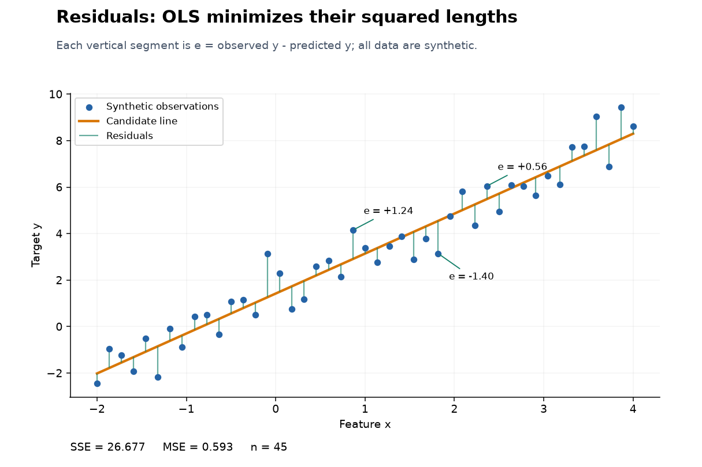
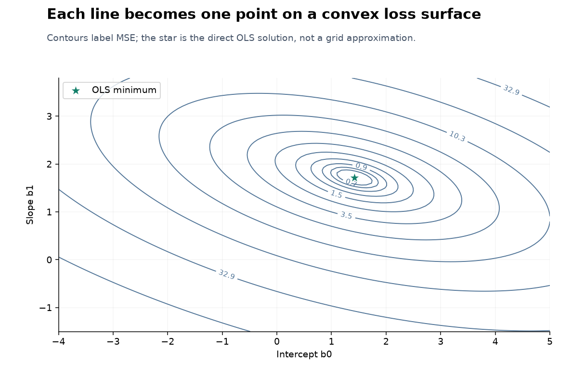
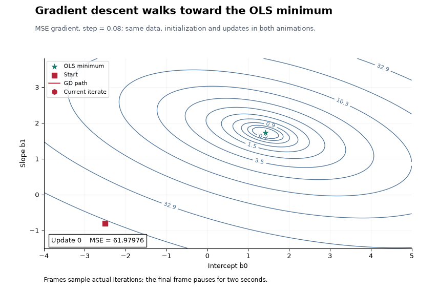
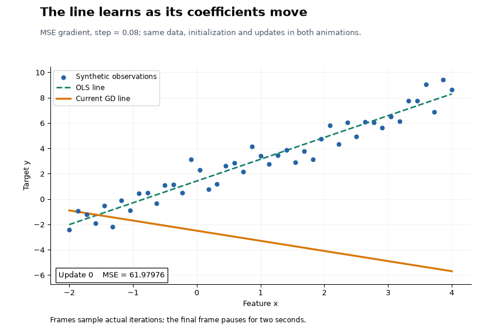
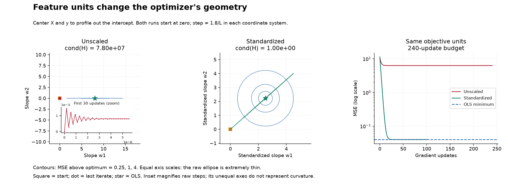

# Day 19 visual laboratory

This laboratory connects observed data, residuals, squared loss, parameter
geometry, optimization, and model limitations. Run it without a notebook or
network access. It uses NumPy, matplotlib, Pillow, scikit-learn, and Plotly
from the shared repository environment.

## Run

From the repository root:

```bash
python 01-classical-machine-learning/19-linear-regression-from-scratch/visual_experiments.py
python 01-classical-machine-learning/19-linear-regression-from-scratch/visual_experiments.py --experiment residuals
python 01-classical-machine-learning/19-linear-regression-from-scratch/visual_experiments.py --experiment loss-surface
python 01-classical-machine-learning/19-linear-regression-from-scratch/visual_experiments.py --experiment gradient-descent
python 01-classical-machine-learning/19-linear-regression-from-scratch/visual_experiments.py --experiment scaling
```

Inside this topic directory, `python visual_experiments.py` is sufficient.
The default output path is relative to the script, not the working directory:
`assets/day19/`. An optional `--output-dir PATH` changes it. Re-running an
experiment replaces its named outputs; unrelated files are left alone.
The CLI verifies each output exists and has nonzero size.

All data are deterministic and synthetic. [visual_math.py](visual_math.py)
contains trace recording and data generation; [visual_experiments.py](visual_experiments.py)
contains rendering and CLI dispatch. The existing
[from_scratch.py](from_scratch.py) provides the OLS and comparison GD fits.
The visual trace helper accepts an explicit design matrix so the centered
scaling experiment can optimize slopes without a redundant intercept.

## Files and conceptual questions

All filenames below are relative to `assets/day19/`. “Regenerable” files are
ignored; generate them locally before opening them.

| CLI experiment | Question | Output | Classification |
|---|---|---|---|
| `residuals` | What is the vertical prediction error? | `01_residuals.png` | Public preview |
| `squared-error` | Why does OLS prefer this line? | `02_sse_comparison.gif` | Regenerable |
| `loss-surface` | How does a line become a point on a loss surface? | `03_loss_surface_3d.html`, `03_loss_contour.png` | HTML regenerable; contour public preview |
| `gradient-descent` | How do gradient steps approach the minimum? | `04_gradient_descent_path.gif` | Public preview |
| `regression-learning` | What do the same steps do to the fitted line? | `04b_regression_learning.gif` | Public preview |
| `learning-rates` | Why can a convex problem still diverge? | `05_learning_rates.png` | Regenerable |
| `scaling` | How do feature units affect curvature and progress? | `06_scaling_geometry.png` | Public preview |
| `outliers` | How do extreme residuals pull the OLS line? | `07_outliers.png` | Regenerable |
| `multicollinearity` | Can predictions be stable while coefficients vary? | `08_multicollinearity.png` | Regenerable |
| `polynomial` | Does linear regression require a straight line in x? | `09_polynomial_features.png` | Regenerable |
| `comparison` | Do the three implementations solve the same problem? | `10_implementation_comparison.png` | Regenerable |

Open the generated `03_loss_surface_3d.html` in a browser to rotate, zoom,
and inspect intercept, slope, and MSE on hover. It embeds Plotly JavaScript
and works offline. GitHub does not render this interactive HTML inline.
If Plotly is unavailable, the generator instead creates
`03_loss_surface_3d.png`; the static contour is still generated.

The GIFs use `FuncAnimation` and `PillowWriter`, render at 855 x 570,
sample at most 48 distinct iteration indices, and pause about two seconds
on the last frame. Nonuniform frame sampling emphasizes early movement;
the frame annotation always reports the actual iteration. The candidate-line
GIF interpolates chosen coefficients and is explicitly **not** a GD run.

Each invocation writes `results_<experiment>.json` (or `results_all.json`)
with actual metrics, environment versions, hypothesis, configuration,
interpretation candidate, limitations, and filenames. These reports remain
ignored. Inspection contact sheets are also ignored intermediate artifacts.
The five public previews total approximately 1 MiB; no large HTML is selected.

## Selected previews

### Residuals define the loss



### Parameters define the surface



### One optimization path, two views





### Feature units change the geometry



## How to interpret the mathematics

The visual traces minimize **MSE**, with gradient
`2 * A.T @ (A @ beta - y) / n`. The reusable comparison optimizer minimizes
**half-MSE**; its gradient is half as large. Step sizes are not interchangeable
between these conventions.

For MSE, let `H = 2 * A.T @ A / n` and `L = lambda_max(H)`.
The exact-arithmetic stable constant-step interval is `0 < eta < 2/L`.
The trace stops at gradient infinity norm <= 1e-9, the iteration budget, or
a safety cutoff (nonfinite arithmetic or MSE > 1e10). A cutoff run retains
only finite, safe points; the last plotted cross precedes the rejected step.
Budget exhaustion does not establish divergence.

The scaling visualization centers both X and y, analytically eliminating the
intercept: for any slopes w, the original intercept is
`mean(y) - mean(X) @ w`. Its two-dimensional contours therefore represent
the actual slope objective, rather than an arbitrary slice through three
parameters. Each run starts at zero, uses `eta = 1.8/L` in its own coordinates,
and has the same 240-update budget. Those are comparable fractions of the
stability boundary, not identical numerical rates.

Raw and standardized panels use equal numerical axis scales within each
panel. Exact ellipses at MSE excess 0.25, 1, and 4 are computed from the
eigendecomposition of the Gram matrix; this resolves a raw valley too thin
for a regular grid. The raw-path inset deliberately magnifies its axes and
must not be used to compare curvature. Standardization cannot generally
remove collinearity. Comparing MSE gaps is more meaningful here than comparing
gradient magnitudes across units.

## Executed experiment record

Executed by Codex on 2026-09-21 using Python 3.11.0rc2, NumPy 2.4.6,
matplotlib 3.11.0, scikit-learn 1.9.0, Pillow 12.3.0, and Plotly 6.9.0.
The all-experiments command above generated every requested view.
The optional projection-vector visualization was not added.

The table records hypotheses and actual outcomes. **Every interpretation is
a candidate for author review, not an author conclusion.** Values are rounded;
the generated JSON retains precision. There are no timing benchmarks.

| Experiment(s) | Hypothesis and configuration | Actual result | Interpretation candidate and limitation |
|---|---|---|---|
| Residuals; candidate lines | Seed 19; 45 x values equally spaced on [-2,4]; y=1.5+1.8x plus Gaussian noise std 0.9. Compare [-2.5,-0.8], [0.5,1.3], and direct OLS. | Candidate MSE 61.979757, 2.941415, 0.592811; OLS SSE 26.676512. | The displayed OLS line improves squared error over those candidates. Selected lines alone do not prove global optimality; this is training fit. |
| Loss surface | Same data; 100 x 100 grid over intercept [-4,5], slope [-1.5,3.8]. | Direct optimum [1.421546,1.719173], MSE 0.592811. | The analytic fit lies at the bottom of the convex bowl. The star is not the best grid cell; singular designs can have flat directions. |
| GD trajectory; learning line | Same data and start [-2.5,-0.8]; MSE step 0.08, budget 180, gradient tolerance 1e-9. | Final MSE 0.592811; max prediction gap to OLS 1.84e-09. Status: budget exhausted. | Predictions approached OLS, although the strict gradient stopping rule was not satisfied within 180 updates. Frames subsample steps; no speed claim. |
| Learning rates | Same data; 240-update budget; rates 0.001, 0.01, 0.05, 0.1, 0.214540, 0.5. | Stability boundary 0.225832. Rate 0.001 ended at MSE 4.715194; 0.01 at 0.599847. Rates 0.1 and 0.214540 met tolerance at updates 145 and 229. Rate 0.5 hit the safety cutoff at update 8. Rate 0.05 reached MSE 0.592811 but exhausted its budget. | Learning rate affects progress even for a convex objective. Near-boundary parameter oscillation can coexist with decreasing loss; the chart reports MSE and does not claim to display parameter signs. |
| Scaling | Seed 1907; 160 uniform rows; feature scales [1,10000]; y=2+8*x1+0.0008*x2 plus noise std 0.2. Center X,y; step 1.8/L; 240-update budget. | Hessian condition numbers 7.80e7 and 1.00255. Raw final MSE 6.312449, gap 6.272293, budget exhausted. Standardized final MSE 0.040157, converged at update 100. | Scaling improved geometry and progress on this nearly independent-feature fixture. Distinct coordinate systems use different rates; objective units remain comparable. |
| Outliers | Original seed-19 data plus points (3.7,-13) and (4,-16). Evaluate both fits on original rows. | Slope changed 1.719173 -> 0.930963; original-row MSE 0.592811 -> 3.287114. | The added extreme residuals pull the fit away from original rows. These are selected contaminants and sensitivity metrics, not test metrics. |
| Multicollinearity | Seed 1909; 100 fixed rows, x2=x1+Gaussian noise std 0.005; mean y=1+2*x1+2*x2. Regenerate target noise std 0.15 for 100 fits; 300 fixed new rows. | Coefficient standard deviations 3.123886 and 3.121220; coefficient-sum std 0.015093. Mean new-row RMSE to noiseless mean 0.023861. | Coefficients traded off while the combined relationship remained stable. New rows preserve dependence; stability is not guaranteed after distribution shift, and no causal claim follows. |
| Polynomial features | Seed 1910; 160 uniform x on [-2,2]; y=3*x² plus noise std 0.65; split seed 19, 120/40 rows. Degree fixed at 2. | Held-out MSE: raw x 9.888027; [x,x²] 0.588272. | A linear-in-parameters model represented the quadratic mean. The synthetic generator favors the chosen specification; degree was not tuned on the test set. |
| Implementation comparison | Seed 1911; 320 rows, three normal features scaled [1,10,0.2]; intercept 2.5, slopes [3,-0.3,4], noise std 0.5; 240/80 split seed 19. GD uses training-only scaling, half-MSE step 0.1 and tolerance 1e-8. | Test MSE about 0.246863, R² 0.985663 for all. Maximum prediction gaps to sklearn: OLS 1.42e-14; GD 3.40e-08. | The implementations agree on this full-rank fixture. GD coefficients were converted back to original units; this is a correctness check, not a performance benchmark. |

## Validation and manual review

Run:

```bash
python -m pytest -q 01-classical-machine-learning/19-linear-regression-from-scratch/tests
python scripts/validate_repo.py syntax
python scripts/validate_repo.py links
```

Tests check loss-grid orientation against direct evaluation, gradients against
finite differences, trajectory/OLS agreement, safe divergence, centered scaling
and exact ellipse geometry, input validation, a CLI run from a different
working directory, preservation of unrelated files, and the matplotlib fallback.
Existing core tests continue to check sklearn parity and singular designs.
The executed suite passed all 46 tests, and repository syntax checks passed
for 139 Python files. All topic documentation links resolve to public Git
candidates. The repository-wide link check still reports six pre-existing
Day 16 preview links; those unrelated files were left unchanged.

Static plots and sampled GIF frames were visually inspected, including final
frame pauses. The offline Plotly HTML was rendered and inspected in headless
Chrome; browser interaction gestures were not automated.

Before publication, the author should review the interpretation candidates,
the rendered previews, and interactive HTML behavior on their browser. The
root README and topic README were left untouched by this visual extension.

## Suggested topic README addition

This is a ready-to-copy section for the author; it has not been inserted into
the topic README. All image targets below are intentionally unignored public
preview candidates.

```markdown
## Visual intuition

### Residuals and OLS

OLS minimizes squared vertical prediction errors.


### Loss surface

Each intercept-slope pair defines a line and its MSE.


### Gradient descent

Follow the same updates in parameter space and data space.


### Why feature scaling matters

Compare actual slope geometry and progress toward the same minimum.


See [the visual guide](VISUAL_GUIDE.md) for commands, the offline interactive
3D surface, measured results, and interpretation caveats.
```

## Rendering references

- [Matplotlib PillowWriter](https://matplotlib.org/stable/api/_as_gen/matplotlib.animation.PillowWriter.html)
  documents the GIF writer used by the generator.
- [Plotly interactive HTML export](https://plotly.com/python/interactive-html-export/)
  documents self-contained HTML export for offline exploration.

