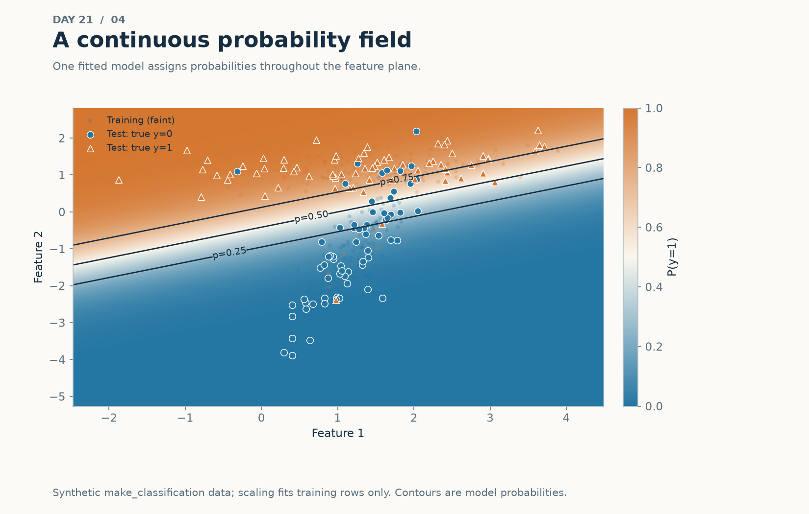
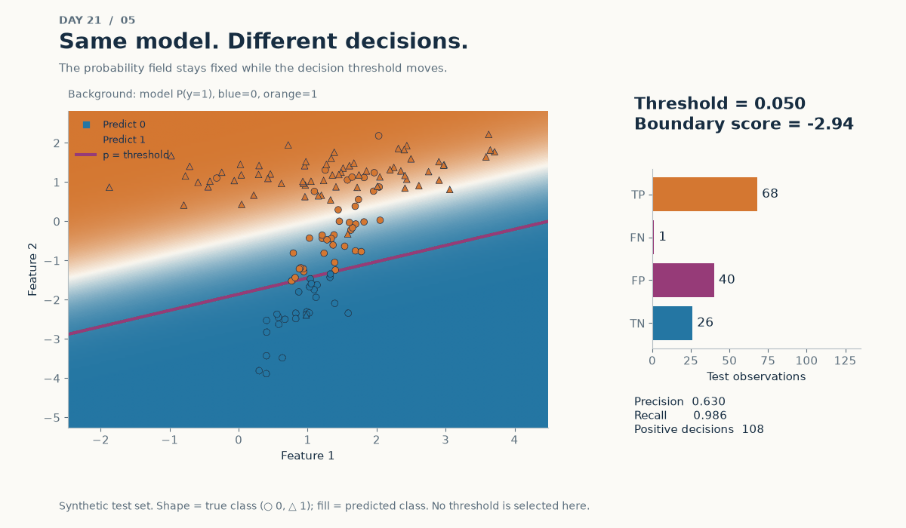
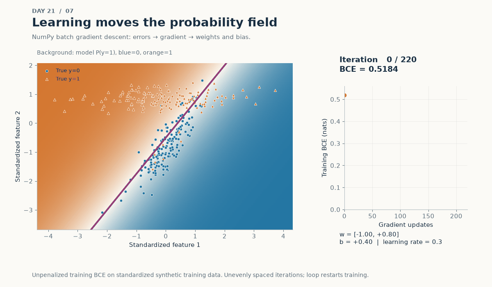
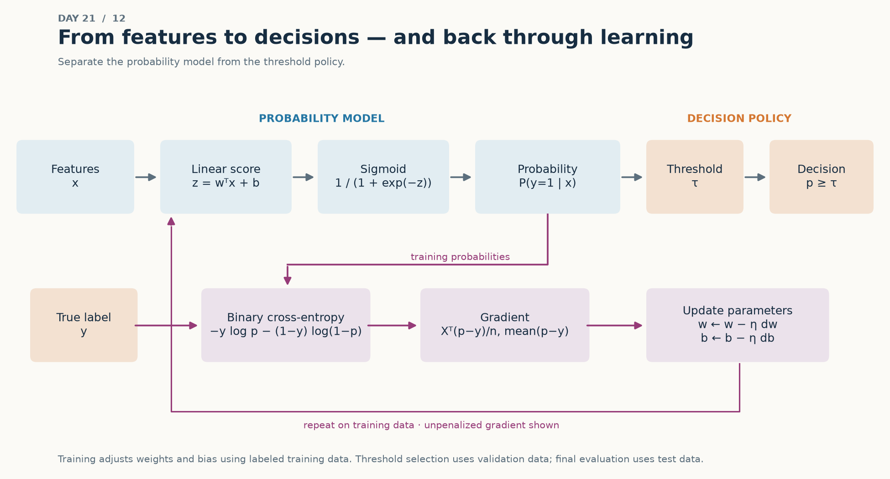

# Logistic Regression Visual Lab

The [generator](logistic_regression_visual_lab.py) creates 14 complementary
views of scores, probabilities, decisions, and training. All data are synthetic.
The experiment helper [visual_experiments.py](visual_experiments.py) reuses
the stable sigmoid, logit, loss, and gradient from [from_scratch.py](from_scratch.py).

## Run locally

From the repository root, using the shared environment in
[pyproject.toml](../../pyproject.toml):

```bash
python 01-classical-machine-learning/21-logistic-regression/logistic_regression_visual_lab.py
python 01-classical-machine-learning/21-logistic-regression/logistic_regression_visual_lab.py --all
python 01-classical-machine-learning/21-logistic-regression/logistic_regression_visual_lab.py --only threshold gradient 3d
python -m pytest -q 01-classical-machine-learning/21-logistic-regression/tests
```

The first two commands are equivalent. There are 13 generation jobs because
the nonlinear comparison produces two views. Output defaults to the topic's
visuals directory, even when invoked from another working directory.
Use --output-dir to override it. The generator needs NumPy, Matplotlib,
scikit-learn, Plotly, and Pillow, already declared in the shared dependencies.
No dashboard, network, credentials, or external dataset is required.

Open visuals/06_probability_surface_3d.html or visuals/13_loss_surface_3d.html
in a browser after generation. Keep plotly.min.js in the same directory:
both pages share that local bundle and work without a server or CDN.
Drag to rotate, scroll to zoom, and hover over the surface or path to inspect
values. Browser WebGL support is required.

The complete run writes measured results and package versions to
visuals/experiment_results.json. Partial runs use experiment_results_selected.json
so they do not replace the complete record. JSON serialization rejects NaN
and Infinity. These records and the HTML files are regenerable artifacts.

## Visual questions and files

| # | Generated file in visuals/ | Question answered |
|---:|---|---|
| 01 | 01_sigmoid.png | How does an unrestricted score become a bounded probability? |
| 02 | 02_probability_odds_logit.png | Why is a model linear in log-odds rather than probability? |
| 03 | 03_cross_entropy.png | Why do equally wrong class decisions have different losses? |
| 04 | 04_decision_boundary.png | What probabilities exist away from the classification line? |
| 05 | 05_threshold_animation.gif | How do decisions and error counts change with a fixed probability model? |
| 06 | 06_probability_surface_3d.html | What does the sigmoid probability sheet look like in three dimensions? |
| 07 | 07_gradient_descent.gif | How do prediction errors move weights, the boundary, and loss? |
| 08 | 08_regularization.png | How do L1/L2 coefficients respond to C on standardized inputs? |
| 09 | 09_nonlinear_limitation.png | What geometry cannot be expressed by raw linear features? |
| 10 | 10_polynomial_features.png | How can a linear classifier produce a curved boundary after transformation? |
| 11 | 11_calibration.png | Can identical rankings have different probability reliability? |
| 12 | 12_full_pipeline.png | How do inference, policy, and the training feedback loop connect? |
| 13 | 13_loss_surface_3d.html | How does gradient descent travel across a one-weight, one-bias loss surface? |
| 14 | 14_sigmoid_parameters.gif | How do weight sign/magnitude and bias change a sigmoid curve? |

## Selected public previews

Only four representative assets are intentionally unignored. The other
numbered views, HTML bundle, metrics, and any inspection artifacts remain local.
The preview set is approximately 6.6 MiB, mostly the two animations.





In the threshold animation, circle/triangle shape identifies the true class;
point fill identifies the current predicted class. The colored background
never changes. A fixed threshold t means score=logit(t), not score zero except
at t=0.5. Counts use test labels, solely to illustrate predeclared thresholds.
No operational threshold is selected from this test set.



The learning animation changes model parameters on training data. Its frame
indices are unevenly spaced to show early movement clearly. The loss curve
uses actual iterations, and looping restarts the demonstration. This is
unpenalized batch descent, separate from the regularized library model in
views 04–06. Floating-point stability comes from signed-logit loss computation,
not score clipping.



## Executed visual experiments

Codex executed these experiments during implementation. Every interpretation
below is a **candidate for author review**, not an author conclusion.
These visual experiments use their own datasets and settings; they do not
replace the earlier example.py experiment in [notes.md](notes.md).

Environment: Python 3.11.0rc2, NumPy 2.4.6, scikit-learn 1.9.0,
Matplotlib 3.11.0, Plotly 6.9.0, Pillow 12.3.0. All random states are 42.
Library logistic fits use max_iter=8000, tol=1e-7; convergence warnings raise
errors. Scaling always fits training rows. All choices below are fixed,
without test-driven tuning.

### Probability geometry and threshold policy — views 04–06

**Hypothesis:** changing a scalar threshold changes decisions and confusion
counts without changing a fitted model's probabilities.

**Configuration:** make_classification with 450 rows, two informative
features, zero redundant features, one cluster per class, class_sep=1.2,
flip_y=0.08. A stratified 70/30 split yields 315 training and 135 test rows.
StandardScaler plus L2 logistic regression uses C=1 and lbfgs.
The static grid is 150×150; the 3D grid is 75×75. Grid extent includes both
splits only for display. No test information enters fitting.
Thresholds animate 0.05→0.95→0.05 in 40 frames with a fixed model.

**Results:** test log loss 0.346336.

| Threshold | Positive decisions | TN | FP | FN | TP | Precision | Recall |
|---:|---:|---:|---:|---:|---:|---:|---:|
| 0.05 | 108 | 26 | 40 | 1 | 68 | 0.6296 | 0.9855 |
| 0.50 | 79 | 53 | 13 | 3 | 66 | 0.8354 | 0.9565 |
| 0.95 | 19 | 64 | 2 | 52 | 17 | 0.8947 | 0.2464 |

**Interpretation candidate:** this run makes model estimation and decision
policy visibly separable.

**Limitation:** one synthetic split and illustrative thresholds, with no
operational costs or capacity constraints. The field extrapolates to empty
parts of the displayed feature plane. No policy is recommended.

### Learning animation — view 07

**Hypothesis:** stable NumPy gradient updates will reduce BCE while moving
the probability field and boundary.

**Configuration:** the same 315 training rows, transformed by their
training-fitted scaler. Initial [w1,w2,b]=[-1,0.8,0.4], learning rate 0.3,
220 unpenalized full-batch updates, 29 selected parameter snapshots.
Only scalar losses are retained at every step.

**Results:** BCE fell from 0.518422 to 0.265143. Every recorded update
decreased loss; the largest successive difference was -0.00001410.

**Interpretation candidate:** the observed path illustrates how gradients
from probability errors improve this training objective.

**Limitation:** fixed-rate training on one small dataset, without a convergence
claim or generalization estimate. The chosen initialization is illustrative,
and selected frames omit intermediate parameter states.

### Regularization paths — view 08

**Hypothesis:** stronger penalties constrain coefficients; L1 may create zeros.

**Configuration:** make_classification with 700 rows, eight features:
three informative, two redundant, three noise; two clusters per class,
flip_y=0.06, shuffle=False. A stratified 70/30 split leaves 490 training rows.
Only standardized training rows are used for these paths.
C=[0.01,0.1,1,10,100]; L2 uses lbfgs, L1 uses saga, both with random_state=42.

**Results:** across ascending C, L2 coefficient norms were
[0.7660,1.4346,1.7141,1.7560,1.7604]; none were exactly zero.
L1 norms were [0.3927,1.4833,1.7861,1.8274,1.8317] and exact-zero counts
were [6,4,2,2,2] out of eight.

**Interpretation candidate:** the observed paths illustrate stronger
constraints and L1 sparsity under this feature scaling.

**Limitation:** no C selection or held-out model comparison is performed.
Correlated coefficients need not individually change monotonically, and
sparsity is not causal feature discovery.

### Representation capacity — views 09–10

**Hypothesis:** polynomial features can express curvature that the raw linear
representation cannot.

**Configuration:** make_moons, 600 rows, noise=0.23; stratified 420/180 split.
Both pipelines use StandardScaler and L2 logistic regression with C=1.
The transformed model first applies PolynomialFeatures(degree=3,
include_bias=False). Degree 3 is fixed before evaluation.

**Results:** raw features scored accuracy 0.855556 and log loss 0.312247;
degree-3 features scored accuracy 0.916667 and log loss 0.221125 on the same
test rows.

**Interpretation candidate:** this split supports a benefit from the richer
representation on this synthetic geometry.

**Limitation:** one dataset and split; no cross-validation or complexity
selection. Different degrees, regularization, noise, or data could reverse
the comparison.

### Calibration and discrimination — view 11

**Hypothesis:** a strictly increasing transformation can preserve ranking
while changing probability reliability.

**Configuration:** 2,400 rows from make_synthetic_data(seed=42), whose latent
Gaussian features generate Bernoulli labels from logit=-0.4+1.4*u1-1.1*u2.
A stratified 50/50 split leaves 1,200 test rows.
Train-only scaling plus L2 logistic regression uses C=1.
Compare its probabilities with sigmoid(2.5*decision_function) on the same
test rows. These are two score transformations, not two fitted classifiers.
calibration_curve uses ten equal-width bins; histograms expose bin support.

**Results:** both ROC-AUC values were 0.834000.
Fitted probabilities had Brier score 0.164525 and log loss 0.495907;
the transformed probabilities had Brier score 0.184626 and log loss 0.662390.
All bins were populated; fitted-model counts ranged from 94 to 189 and
transformed-model counts from 44 to 468.

**Interpretation candidate:** identical ranking performance coexists here
with different probability quality and reliability curves.

**Limitation:** a deliberately modified score and one synthetic holdout.
Bin estimates are noisy; no calibration model, uncertainty interval, or
subgroup reliability analysis was fitted.

### Optimization landscape — view 13

**Hypothesis:** a one-weight logistic loss surface can display a descending
gradient path through its convex geometry.

**Configuration:** 30 evenly spaced x values in [-2.5,2.5], each repeated four
times; independent Bernoulli draws with probability sigmoid(0.9*x-0.35),
default_rng(42). This gives 120 observations with overlapping labels.
Evaluate unpenalized BCE on a 65×65 grid: weight [-2,3], bias [-2.5,2.5].
Start [w,b]=[-1.3,1.4], learning rate 0.3, 160 updates.

**Results:** BCE fell from 1.757330 to 0.530000; final parameters were
approximately [0.905911,-0.094486].

**Interpretation candidate:** the plotted path is consistent with descent
on the convex objective described in the theory notes.

**Limitation:** a finite sampled surface illustrates convexity rather than
proving it. Two free parameters are chosen for visibility; this is a
training-only experiment and not a benchmark or parameter-recovery guarantee.

Views 01–03, 12, and 14 are mathematical demonstrations rather than fitted
model comparisons. View 14 varies one parameter at a time and does not imply
that changing bias shifts the curve by the same distance for every weight.

## Validation and review

The implementation was run to generate every numbered PNG, GIF, and HTML.
Image inspection covered the static views and representative animation
frames. The GIFs loop with fixed axes; frames are bounded below 50.
Numerical tests cover threshold geometry, train-only scaling, real gradient
updates, loss reduction, ranking preservation, finite results, and the loss
grid. Static and offline-HTML generation also have smoke tests.

Both Plotly pages were opened in isolated headless Edge with HTTP/HTTPS
requests blocked. Their surfaces rendered, drag rotation and wheel zoom
changed the camera, hover events fired, and no JavaScript runtime exception
was observed. Screenshots were inspected. This verifies that browser setup;
the author should still inspect interaction and text on their normal display.

Before committing, review the four preview choices, animation pacing, and
the interpretation candidates above. In particular, do not promote the
thresholds, observed calibration, polynomial comparison, or sparse features
into general application conclusions.