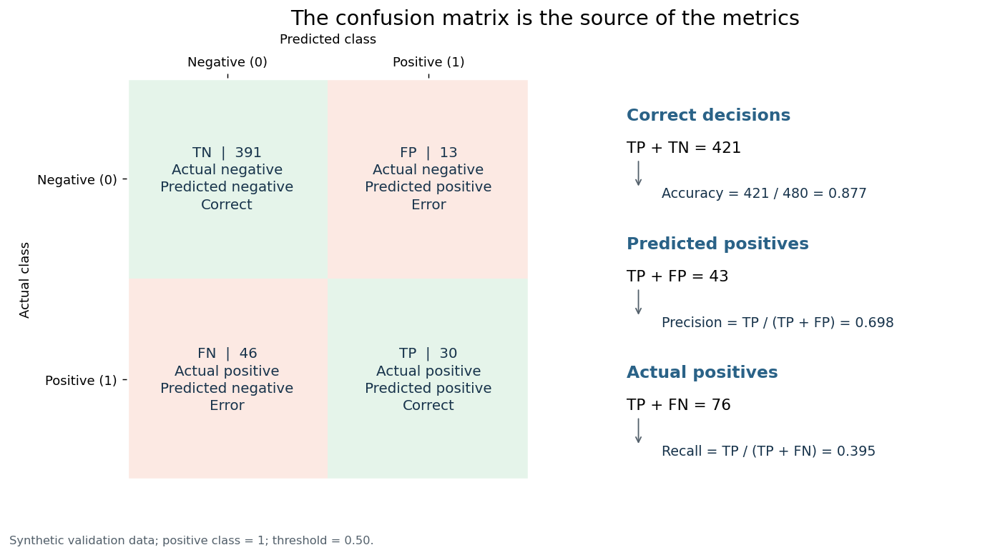
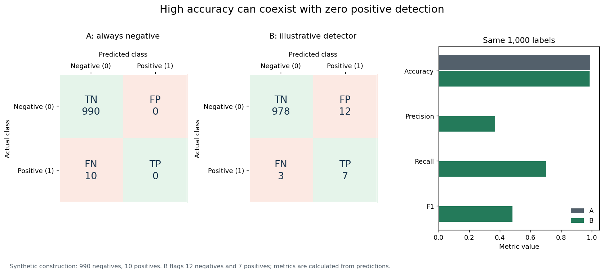
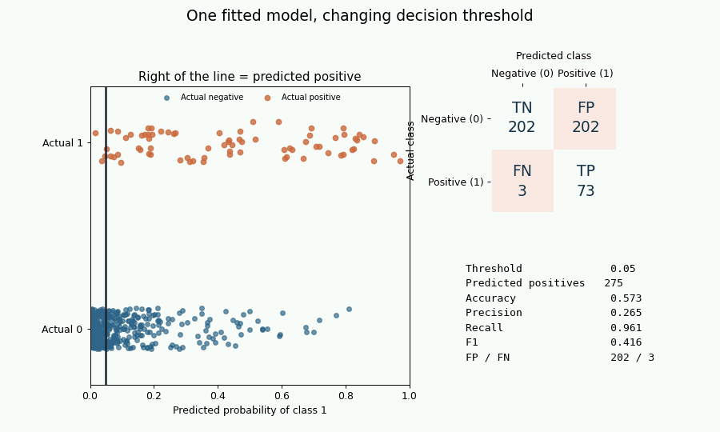
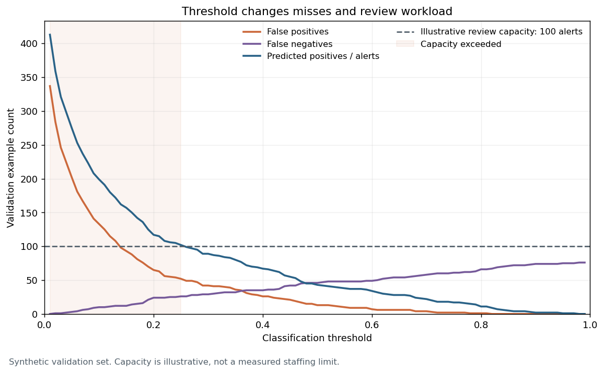

# Classification Metrics Visual Lab

The [generator](visualize_classification_metrics.py) produces nine views from locally generated synthetic data. The visual sequence moves from the four confusion-matrix cells to scalar metrics, threshold decisions, prevalence effects, and review workload. The [numerical tests](tests/test_visual_lab.py) cover reusable threshold, F1, and prevalence calculations.

## Run

From the repository root, using the shared dependencies in [pyproject.toml](../../pyproject.toml):

```bash
python 01-classical-machine-learning/22-classification-metrics/visualize_classification_metrics.py
python -m pytest -q 01-classical-machine-learning/22-classification-metrics/tests
```

The default command creates `assets/` next to the script and overwrites its nine deterministic outputs. `--output-dir PATH` sends outputs elsewhere. It requires NumPy, Matplotlib, scikit-learn, Pillow, and Plotly, all in the shared project dependencies. No credentials, network calls, notebook, or server are required. Open `assets/f1_surface_3d.html` in a browser to rotate the self-contained Plotly surface; browser JavaScript/WebGL support is required.

## Visual questions and generated files

| Output in `assets/` | Question it answers |
|---|---|
| `confusion_matrix_foundation.png` | Which decisions are TP, TN, FP, and FN, and where do accuracy, precision, and recall get their numerators and denominators? |
| `accuracy_imbalance.png` | How can an always-negative model score 99% accuracy yet detect no positive cases? |
| `threshold_tradeoff.gif` | What changes in the sample decisions, confusion matrix, and metrics as one threshold moves? |
| `metrics_vs_threshold.png` | Which metrics change across validation thresholds, and where is the best F1 on this grid? |
| `precision_recall_denominators.png` | Why do precision and recall divide by different groups? |
| `f1_harmonic_mean.png` | Why does F1 penalize uneven precision and recall, and where is it high? |
| `f1_surface_3d.html` | How does the same F1 landscape behave when rotated? |
| `prevalence_metric_sensitivity.png` | What happens to expected precision when prevalence changes at fixed TPR/FPR? |
| `error_tradeoff_operational.png` | How do false alarms, misses, and illustrative review capacity vary with threshold? |

## Selected public previews

Four small files are intentionally unignored and referenced here. The GIF is about 0.5 MB, and the selected set is under 1 MB. All other outputs, including the approximately 5 MB standalone HTML, are regenerable and ignored.









## Executed experiments

### A. Severe imbalance

**Hypothesis:** an always-negative classifier can appear accurate when positives are rare while detecting none of them.

**Configuration:** construct exactly 1,000 synthetic labels: 990 negative and 10 positive. Classifier A predicts all negative. An illustrative classifier B flags 12 negative and 7 positive cases. The latter is a constructed prediction pattern, not a fitted model. Counts and rates are calculated from these labels and predictions.

**Result:** A has TN=990, FP=0, FN=10, TP=0, accuracy 0.9900 and recall 0.0000. B has TN=978, FP=12, FN=3, TP=7, accuracy 0.9850 and recall 0.7000. A makes no positive predictions, so its precision is undefined mathematically and reported as zero under the topic's explicit software convention.

**Interpretation candidate — author review:** the 0.99 accuracy of A hides complete failure on the designated positive class; B trades some false alarms for detection.

**Limitations:** B is hand-constructed for explanation. Neither prediction set estimates real model performance or operating cost.

### B. Threshold movement and held-out evaluation

**Hypothesis:** moving the threshold on a fixed probability model will change alert volume and TP/FP/FN counts. Raising the threshold cannot increase recall on these fixed scores; precision need not move monotonically.

**Configuration:** `make_classification` generates 2,400 rows with 10 features, 6 informative and 2 redundant, 85/15 class weights, label-noise parameter `flip_y=0.02`, class separation 1.1, and seed 22. Stratified splits provide 1,440 train, 480 validation, and 480 test rows; both later sets contain 76 observed positives. A train-only `StandardScaler` and `LogisticRegression(max_iter=2000)` produce probabilities. The animation shows 23 validation thresholds from 0.05 to 0.95. Curves and threshold choices use a 99-point validation grid from 0.01 to 0.99. The test set is used only for a fixed 0.50 policy and the policy selected by validation F1.

**Result:** at validation threshold 0.50, TN=391, FP=13, FN=46, TP=30, accuracy 0.8771, precision 0.6977, recall 0.3947, F1 0.5042, and 43 positive decisions. The validation-grid maximum F1 is 0.5734 at threshold 0.40. A threshold with recall at least 0.90 exists at 0.08 (precision 0.3094, recall 0.9079). A threshold with precision at least 0.90 exists at 0.78 (precision 0.9333, recall 0.1842). The constraint candidates maximize the other rate among thresholds that satisfy the stated constraint on this grid.

| Test policy | TN | FP | FN | TP | Accuracy | Precision | Recall | F1 | Alerts |
|---|---:|---:|---:|---:|---:|---:|---:|---:|---:|
| Fixed 0.50 | 396 | 8 | 45 | 31 | 0.8896 | 0.7949 | 0.4079 | 0.5391 | 39 |
| Validation-F1 choice, 0.40 | 386 | 18 | 30 | 46 | 0.9000 | 0.7188 | 0.6053 | 0.6571 | 64 |

**Interpretation candidate — author review:** on this one split, the lower selected threshold found 15 more test positives and raised 10 more false alarms than 0.50. The validation F1 maximum gives one possible rule for this exercise; an operational objective could choose differently.

**Limitations:** one synthetic generator, seed, split, classifier, and 99-point grid. The validation F1 maximum is subject to selection noise, and this small test set does not establish future benefit, calibration, subgroup reliability, or an operational threshold. The default and selected test results are descriptive; neither should be repeatedly tuned against the test set.

### C. Controlled prevalence sensitivity

**Hypothesis:** even with fixed conditional TPR and FPR, expected precision changes as positive prevalence changes.

**Configuration:** calculate expected confusion-matrix shares for prevalence from 1% to 50%, holding TPR=0.80 and FPR=0.05. This is a parameterized expectation, not an empirical resampling of the fitted classifier.

**Result:** at 1% prevalence, expected precision is 0.1391, accuracy 0.9485, recall 0.8000, and F1 0.2370. At 50% prevalence, expected precision is 0.9412, accuracy 0.8750, recall 0.8000, and F1 0.8649.

**Interpretation candidate — author review:** a low base rate can leave most positive alerts false even when TPR is comparatively high and FPR is 0.05.

**Limitations:** real TPR and FPR may change with population, feature distribution, measurement, and model calibration. The plotted values are controlled expectations, not observed deployment rates.

### D. Illustrative review capacity

**Hypothesis:** a lower threshold may exceed a finite review team's alert capacity while catching more positives.

**Configuration:** use the same validation-grid rows as B and overlay an illustrative 100-alert capacity against predicted positives, FP, and FN.

**Result:** threshold 0.01 produces 413 alerts, including 337 FP and no FN. Threshold 0.25 produces 102 alerts, 52 FP and 26 FN; it is the highest threshold on the grid above capacity. At 0.50, 43 alerts are below capacity, with 13 FP and 46 FN.

**Interpretation candidate — author review:** a threshold policy should account for absolute error volumes and review capacity, not only a rate.

**Limitations:** 100 is an illustrative constraint, not measured staffing capacity or a cost model. The relationship comes from one validation sample; production volume and prevalence may differ.

The numerical helpers were checked against scikit-learn for the 0.50 validation decisions. Undefined precision, recall, and F1 use the [topic's documented zero convention](notes.md#undefined-denominators-and-reporting-policy). The visual lab does not establish that any threshold is suitable for deployment.
