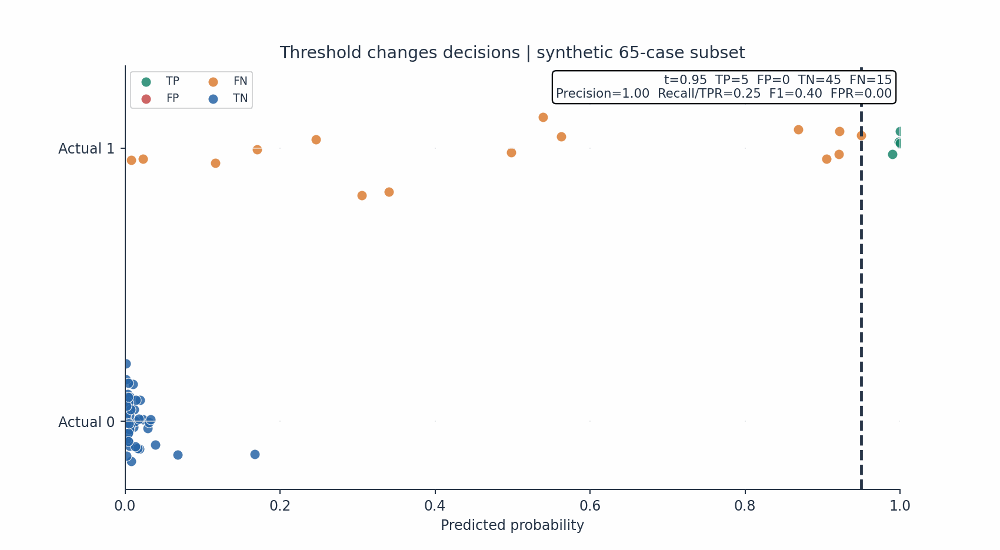
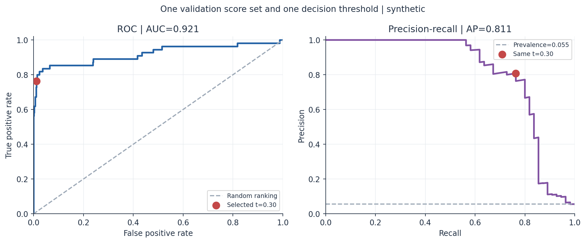
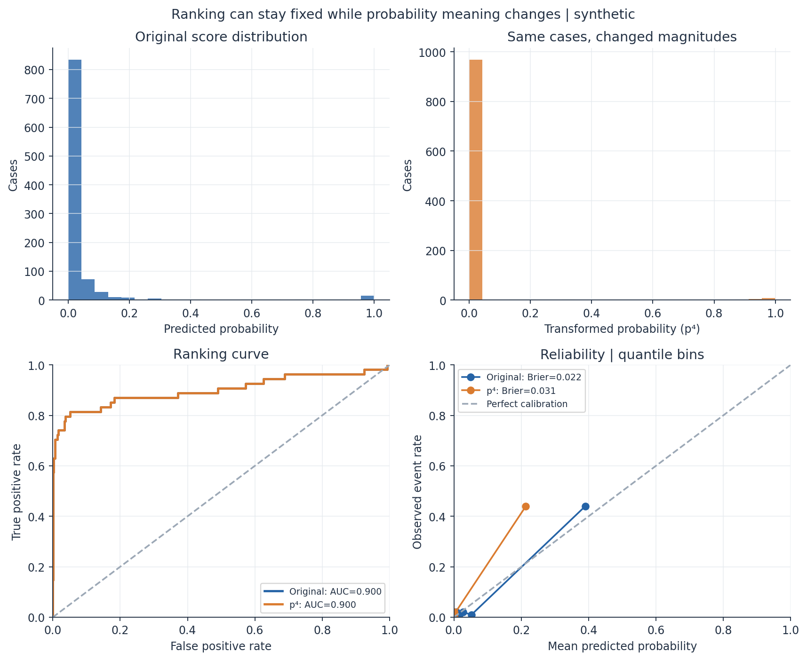

# Classification Metrics II

Day 23 separates three questions about a binary classifier: **Does it rank positives above negatives? Are its scores usable as probabilities? Which cases should trigger action?** ROC-AUC and average precision (AP) address ranking, calibration diagnostics address probability quality, and a validation-selected threshold defines a decision policy. Class **1** is positive throughout.

This matters in fraud review, screening, and quality gates: a strong global ranking can still produce too many alerts, and a risk score can rank well while understating event probability.

## Read and run

| File | Purpose |
|---|---|
| [notes.md](notes.md) | ROC and PR geometry, AP versus PR-AUC, prevalence, calibration, decision costs, and executed evidence |
| [example.py](example.py) | Seeded synthetic logistic regression with separate train, validation, and test splits |
| [from_scratch.py](from_scratch.py) | Educational pairwise ROC-AUC and threshold policy calculations |
| [tests/test_metrics.py](tests/test_metrics.py) | Ties, scikit-learn parity, threshold selection, and invalid inputs |
| [interview_questions.md](interview_questions.md) | Practical and mathematical review questions |

Use the shared dependencies in [pyproject.toml](../../pyproject.toml). From the repository root:

```bash
python -m pip install -e ".[dev]"
python 01-classical-machine-learning/23-classification-metrics-ii/example.py
python 01-classical-machine-learning/23-classification-metrics-ii/from_scratch.py
python -m pytest -q 01-classical-machine-learning/23-classification-metrics-ii/tests
```

The example creates a **synthetic** 5,000-row binary dataset; no external dataset is used. It fits preprocessing and logistic regression on 3,000 training rows, chooses a threshold on 1,000 validation rows using a minimum precision of 0.60, and evaluates once on 1,000 test rows. It also raises test probabilities to the fourth power to study a ranking-preserving distortion. It prints ROC-AUC, AP, Brier score, five quantile calibration bins, and alert counts. It creates no assets. The scratch code is for learning, not a production metric library.

## What was measured

On this seeded test split, the original scores and their fourth powers both yielded ROC-AUC **0.9304** and AP **0.5875**. Brier score changed from **0.0321** to **0.0430**. The validation-selected threshold was **0.363422**; it produced 42 validation alerts at precision **0.6190** and 41 test alerts at precision **0.7073**. These are one-run synthetic observations, not expected production performance. The hypotheses, configuration, full results, interpretation candidates **for author review**, and limitations are in [the experiment record](notes.md#executed-synthetic-experiments).

## Key takeaways

- ROC-AUC measures pairwise ordering over thresholds; it does not assess probability calibration.
- AP summarizes the precision-recall curve without trapezoidal interpolation. Report which PR summary is used and the positive prevalence.
- Precision can fall when prevalence falls even if TPR and FPR stay fixed.
- A threshold is selected against an operational constraint on validation data; the untouched test set estimates performance of that selected policy.
- Calibration bins and Brier score complement ranking metrics. Small bins and distribution shifts limit what one split can establish.

This study follows [Classification Metrics I](../22-classification-metrics/) and [validation boundaries](../17-validation-and-leakage/).

## Visual laboratory

The [visual generator](visualizations.py) connects the same fixed model scores to moving thresholds, confusion counts, ROC/PR operating points, probability quality, and decision costs. It uses seeded synthetic data and prints actual calculated metrics. The [visual guide](VISUAL_GUIDE.md) maps every output to a question and records experiment configuration, results, interpretation candidates for author review, and limitations.

From the repository root:

```bash
python 01-classical-machine-learning/23-classification-metrics-ii/visualizations.py
```

Five small previews are intentionally public; the remaining GIFs, PNGs, and two self-contained Plotly HTML files regenerate under the ignored `outputs/` directory. Open the HTML files locally for the 3D cost surface and linked threshold explorer.

| Selected view | Question |
|---|---|
| [Threshold sweep](outputs/threshold_sweep.gif) | Which cases become TP, FP, FN, and TN as the cutoff moves? |
| [ROC versus PR](outputs/roc_vs_pr.png) | Where does the same selected threshold lie on both curves? |
| [Prevalence and PR](outputs/prevalence_pr_curves.png) | What changes when class-conditional scores stay fixed but prevalence changes? |
| [Threshold metric landscape](outputs/metrics_vs_threshold.png) | Which grid threshold maximizes F1 or meets a precision constraint? |
| [Ranking versus calibration](outputs/ranking_vs_calibration.png) | Why can a monotonic transform preserve ranking while changing probability quality? |







