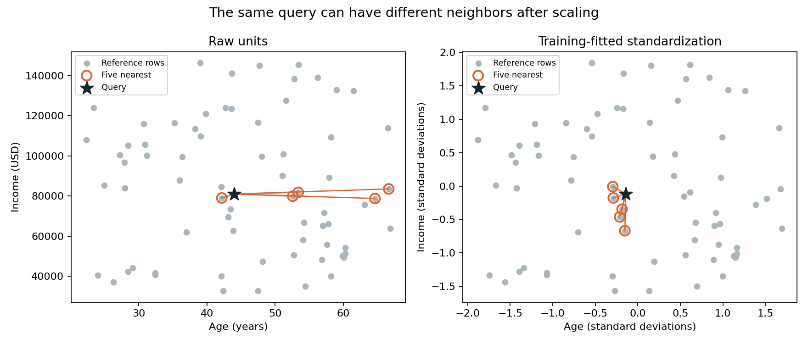
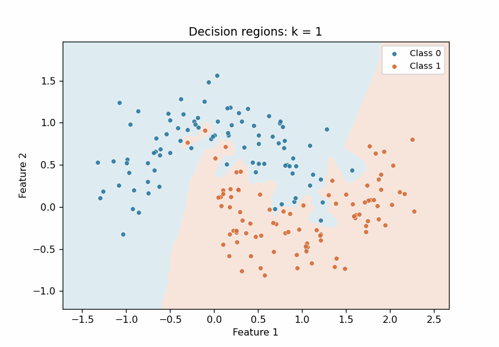
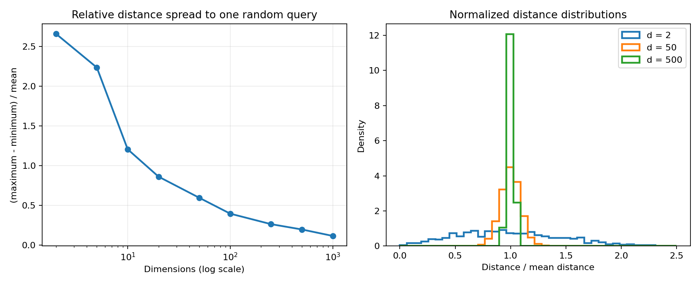

# K-Nearest Neighbors

K-nearest neighbors (KNN) predicts from nearby labeled examples. Classification uses a vote among the nearest training rows; regression can average their targets. Its apparent simplicity hides a central modeling decision: **what does “near” mean for these features?** Units, irrelevant dimensions, and the choice of distance can change the neighbor set.

KNN is useful as a local baseline and as a way to reason about distance-based retrieval. It also exposes practical costs: storing training rows, repeated distance calculations at prediction time, and sensitivity to feature representation.

## Study path

| File | Purpose |
|---|---|
| [notes.md](notes.md) | Distance, scaling, choice of k, dimensionality, validation, and an executed synthetic comparison |
| [example.py](example.py) | A fixed-k scikit-learn comparison with and without train-fitted scaling |
| [from_scratch.py](from_scratch.py) | Small exact Euclidean classifier with uniform voting and explicit tie behavior |
| [tests/test_knn.py](tests/test_knn.py) | Parity, ties, invalid input, and data reproducibility checks |
| [visualizations.py](visualizations.py) | Static geometry, voting, dimensionality, and retrieval experiments |
| [interactive_3d.py](interactive_3d.py) | Standalone, rotatable three-feature neighborhood |
| [VISUAL_GUIDE.md](VISUAL_GUIDE.md) | Visual questions, executed measurements, limitations, and output policy |
| [tests/test_visualizations.py](tests/test_visualizations.py) | Numerical checks for the visual experiments |

The example creates **synthetic** data: one predictive feature and one independent feature whose units are 100 times larger. It uses no external dataset and creates no assets itself. The scratch classifier is an educational implementation, not a replacement for a production neighbor-search library.

From the repository root, install the shared dependencies in [pyproject.toml](../../pyproject.toml), then run:

```bash
python -m pip install -e ".[dev]"
python 01-classical-machine-learning/24-k-nearest-neighbors/example.py
python 01-classical-machine-learning/24-k-nearest-neighbors/from_scratch.py
python -m pytest -q 01-classical-machine-learning/24-k-nearest-neighbors/tests
python 01-classical-machine-learning/24-k-nearest-neighbors/visualizations.py
python 01-classical-machine-learning/24-k-nearest-neighbors/interactive_3d.py
```

## Observed comparison

With seed 24, fixed `k=5`, a stratified 300/100 train/test split, and Euclidean distance, raw KNN had test accuracy **0.590**; a pipeline that fits `StandardScaler` on training data had **0.820**. These are one-run synthetic observations, not a benchmark or evidence that scaling always helps. The hypothesis, configuration, interpretation candidate **for author review**, and limits are recorded in [notes.md](notes.md#executed-synthetic-comparison).

## Key takeaways

- KNN is defined jointly by the feature representation, distance function, voting rule, and `k`.
- Scaling belongs inside the training or cross-validation pipeline; fitting it before a split leaks information.
- Small `k` can react strongly to noise; large `k` smooths local structure and can favor the majority class.
- High-dimensional distance can lose contrast under common data assumptions. More dimensions do not automatically supply better neighbors.
- Exact search keeps training data and can make prediction expensive. Indexing, approximation, or a different model may be needed at scale.

This follows the [validation and leakage](../17-validation-and-leakage/) study and the [classification metrics](../22-classification-metrics/) study.

## Visual lab

The visual generators use deterministic synthetic data to show neighbor selection, L1 versus L2 geometry, training-fitted scaling, voting, changing `k`, dimensionality, and a small cosine-retrieval analogy. The 3D script writes a self-contained `assets/knn_3d.html` for local rotation; it depicts three actual informative features, not a projection of the high-dimensional simulations.

These three inspected assets are the public previews:

| Preview | Visual question |
|---|---|
| [Scaling changes neighbors](assets/scaling_neighbors.png) | Which reference rows are selected before and after standardization? |
| [Decision regions as k changes](assets/k_decision_boundary.gif) | How does locality change over seven fixed `k` values? |
| [Distance concentration](assets/distance_concentration.png) | How did relative spread change in the seeded Gaussian simulation? |







The other PNGs and the HTML remain ignored, regenerable outputs. The [visual guide](VISUAL_GUIDE.md) lists them, records executed configurations and values, and marks interpretation candidates for author review. The animation shows training-set geometry; it does not select an optimal `k`.
