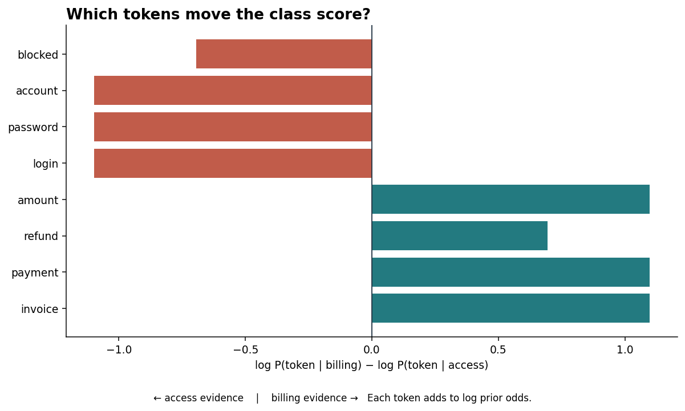
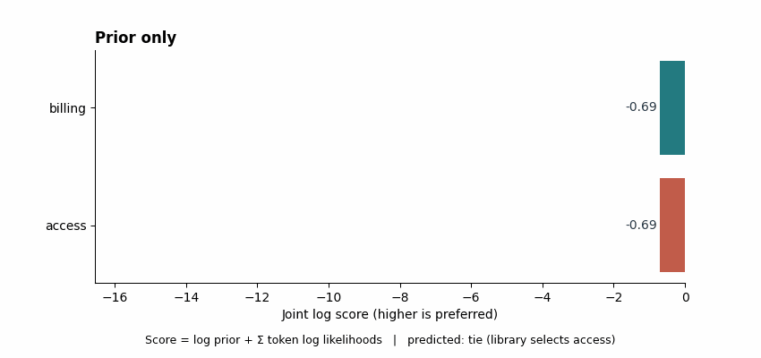

# Naive Bayes

Naive Bayes classifies an observation by combining a class prior with evidence from its features. This study focuses on **Multinomial Naive Bayes for token counts**: how a small set of class-specific counts becomes a text classifier, and what its probabilities can and cannot mean.

The conditional-independence simplification makes class likelihoods cheap to estimate. It is useful for sparse text baselines such as document or support-ticket routing, where a transparent lexical model can be trained before considering more complex approaches. Correlated words and missing context can still make its scores misleading.

## What to study and run

| File | Purpose |
|---|---|
| [notes.md](notes.md) | Bayes rule, multinomial scoring, smoothing, variants, limitations, and next experiments |
| [example.py](example.py) | A scikit-learn `CountVectorizer` and `MultinomialNB` pipeline on synthetic support tickets |
| [from_scratch.py](from_scratch.py) | Educational count-matrix implementation exposing priors, token likelihoods, and log scores |
| [tests/test_naive_bayes.py](tests/test_naive_bayes.py) | Numerical parity, smoothing, vocabulary, and input-validation checks |
| [interview_questions.md](interview_questions.md) | Conceptual and operational questions with concise answers |
| [visual_math.py](visual_math.py) and [visualizations.py](visualizations.py) | Reusable score calculations and 11 offline visual explanations |
| [tests/test_visualizations.py](tests/test_visualizations.py) | Numerical and representative artifact checks |
| [VISUAL_GUIDE.md](VISUAL_GUIDE.md) | Visual questions, reproduction, output policy, executed observations, and limits |

The support tickets are **code-defined synthetic text**. They are a mechanism demonstration, not an evaluation dataset. There is no external dataset, measured accuracy claim, or saved model. Four inspected visual previews are included; other outputs are generated locally. The scratch implementation deliberately accepts dense integer-count matrices; it is not a production substitute for sparse library code.

From the repository root, install the shared dependencies in [pyproject.toml](../../pyproject.toml), then run:

    python -m pip install -e ".[dev]"
    python 01-classical-machine-learning/25-naive-bayes/example.py
    python 01-classical-machine-learning/25-naive-bayes/from_scratch.py
    python -m pytest -q 01-classical-machine-learning/25-naive-bayes/tests

The pipeline fits its vocabulary only during `fit` on the training texts. Prediction transforms new text with that fitted vocabulary. A token outside it contributes nothing to the count vector; smoothing handles a different case, a known token absent from one class's training texts.

## Visual companion

Run all 11 views locally, or select one by name:

    python 01-classical-machine-learning/25-naive-bayes/visualizations.py --all
    python 01-classical-machine-learning/25-naive-bayes/visualizations.py --view token-evidence
    python 01-classical-machine-learning/25-naive-bayes/visualizations.py --view posterior-3d

The [visual guide](VISUAL_GUIDE.md) maps every question to its output and records each executed synthetic configuration, observed value, interpretation candidate **for author review**, and limit. The generator creates PNG figures, three GIF animations, and one rotatable, self-contained HTML score surface. The HTML and nonselected images stay ignored and can be regenerated with the commands above.

These four inspected files are the small public preview set:

| Preview | Visual question |
|---|---|
| [Bayes update](outputs/01_bayes_update.png) | How does the word `invoice` move a balanced prior? |
| [Token evidence](outputs/03_token_evidence.png) | Which fitted words push log odds toward each class? |
| [Accumulating log scores](outputs/04_log_evidence_accumulation.gif) | How does the class choice emerge token by token? |
| [Copied evidence](outputs/10_correlated_evidence.png) | How can duplicated signals make a model posterior too extreme? |

The copy example illustrates a possible calibration failure mechanism; it is not a measured calibration study. The score surface extends an integer-count rule continuously for explanation and should not be mistaken for a probability-quality result.

## Key takeaways

- Bayes' rule combines prior and likelihood; the evidence denominator is shared across classes for a fixed document.
- Multinomial NB scores token **counts** in log space, adding a class log prior and one token log likelihood per occurrence.
- Additive smoothing keeps vocabulary tokens unseen in a class from forcing that class likelihood to zero.
- Conditional independence simplifies estimation, but repeated or correlated lexical signals can exaggerate confidence. Treat `predict_proba` as a model output that needs calibration checks before use in probability-sensitive decisions.
- Feature representation, prior shift, leakage boundaries, and class-aware evaluation matter as much as the formula.

The notes distinguish this count model from Bernoulli, Gaussian, and Complement NB and list experiments that remain **suggestions**, not reported findings.
