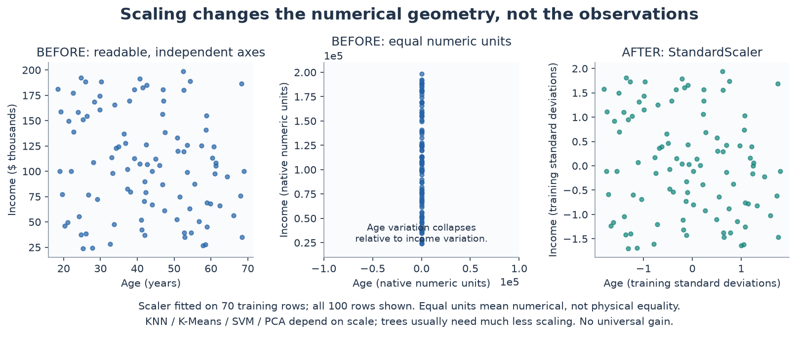

# Day 32 — Feature Engineering for Tabular Data

What should a model see when the input spans customer attributes and an event
history? This study connects categorical encoding, scaling, binning,
interactions, and aggregation to the representation a model can learn from.
The practical boundary is information availability: a transaction recorded
after prediction time cannot become a historical feature for that prediction.

A linear classifier can use engineered terms to represent nonlinear structure.
A transaction summary also brings information from a second source table into
the customer representation. These are different changes, and the experiment
separates adding history from adding nonlinear terms.

## Implementation and files

| File | Purpose |
|---|---|
| [notes.md](notes.md) | Formulas, representation choices, temporal semantics, mistakes, and measured experiment records |
| [example.py](example.py) | Three fixed logistic-regression pipelines on synthetic customer and transaction data |
| [from_scratch.py](from_scratch.py) | Educational training-only scaling, quantile thresholds, and a two-column product |
| [tests/test_feature_engineering.py](tests/test_feature_engineering.py) | Numerical parity, invalid inputs, timestamp cutoffs, unknown categories, and preprocessing isolation |
| [interview_questions.md](interview_questions.md) | Questions grounded in feature semantics and implementation decisions |
| [references.md](references.md) | Official preprocessing and leakage documentation |
| [visual_feature_engineering.py](visual_feature_engineering.py) | Deterministic PNG/GIF sequence and an offline interactive 3D feature lift |
| [README_VISUALS.md](README_VISUALS.md) | Visual questions, artifact inventory, assumptions, and executed generation record |
| [tests/test_visual_feature_engineering.py](tests/test_visual_feature_engineering.py) | Visual geometry, decision-plane algebra, temporal filtering, and rendering smoke checks |

The example uses **entirely synthetic data**, with one snapshot per customer.
It compares the same model and split under three prespecified representations:

1. Baseline: standardized age, income, and balance plus one-hot region/channel.
2. Aggregates: baseline plus count, mean, sum, and maximum transaction amount
   from the preceding 30 days.
3. Engineered: aggregates plus four one-hot quantile age bins and one
   standardized income–balance interaction. Raw age remains available.

All learned transformations fit on training rows. Transaction features use
events in `[prediction_time - 30 days, prediction_time)` whose
`available_at < prediction_time`. The ID and timestamps are excluded from the
classifier. Tests also verify that accidentally supplied labels are ignored.

This pattern is relevant to customer risk, fraud, churn, or activity modeling,
but this example validates no business application or deployed serving system.

## Run from the repository root

Use the shared dependencies in [pyproject.toml](../../pyproject.toml):

```bash
python -m pip install -e ".[dev]"
python 01-classical-machine-learning/32-feature-engineering/example.py
python 01-classical-machine-learning/32-feature-engineering/from_scratch.py
python -m pytest -q 01-classical-machine-learning/32-feature-engineering/tests
```

The practical example prints ROC-AUC, average precision (AP), and feature
counts. It overwrites an ignored `outputs/feature_comparison.json` relative to
the script, recording configuration, versions, measurements, limitations, and
review status. The scratch demo prints transformations of two holdout rows.
Neither example needs a public dataset download or notebook.

## Visual learning companion

Run the separate visual generator from the repository root:

```bash
python 01-classical-machine-learning/32-feature-engineering/visual_feature_engineering.py
```

The [visual guide](README_VISUALS.md) explains all 13 views. Start with scaling
geometry, the interaction lift, and the historical aggregation storyboard.
The 3D HTML embeds Plotly for offline rotation, zoom, and point inspection.



Selected previews: [interaction in 2D](visuals/06_interaction_2d.png) and
[point-in-time correctness animation](visuals/10_point_in_time_leakage.gif).
These three previews are intentionally unignored; the other artifacts, including
the large HTML, regenerate locally. Visual interpretations remain pending
author review. No predictive improvement is claimed by this companion.

## Measured behavior and boundaries

On the recorded seed-42 customer split:

| Representation | Features | Holdout ROC-AUC | Holdout AP |
|---|---:|---:|---:|
| Baseline | 10 | 0.6679 | 0.5352 |
| Added aggregates | 14 | 0.6867 | 0.6004 |
| Added bins and interaction | 19 | 0.7053 | 0.6062 |

These are executed demonstrations, not benchmarks. The synthetic target
explicitly depends on history, age regimes, and a product term. One split cannot
establish general improvement, and the final step does not isolate binning from
interaction effects. Configuration and limitations are in the
[experiment record](notes.md#executed-experiments).
**Interpretation candidates remain pending author review.**

## Key takeaways

Feature design depends on the model: scaling changes distance and penalty
geometry; bin indicators and products expand what a linear score can represent.
Aggregation needs a defined entity, window, cutoff, availability rule, and
no-history convention. Pipelines protect fitted preprocessing, while event
availability must be enforced by the feature computation itself.

Use [validation and leakage](../17-validation-and-leakage/),
[regularization](../20-regularization/), and
[logistic regression](../21-logistic-regression/) as prerequisites.
