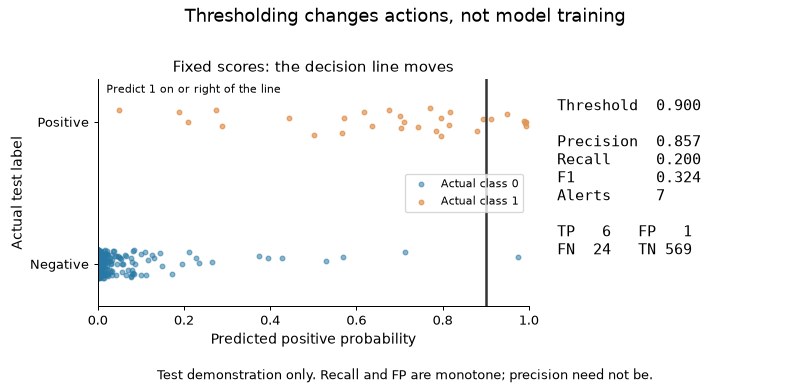
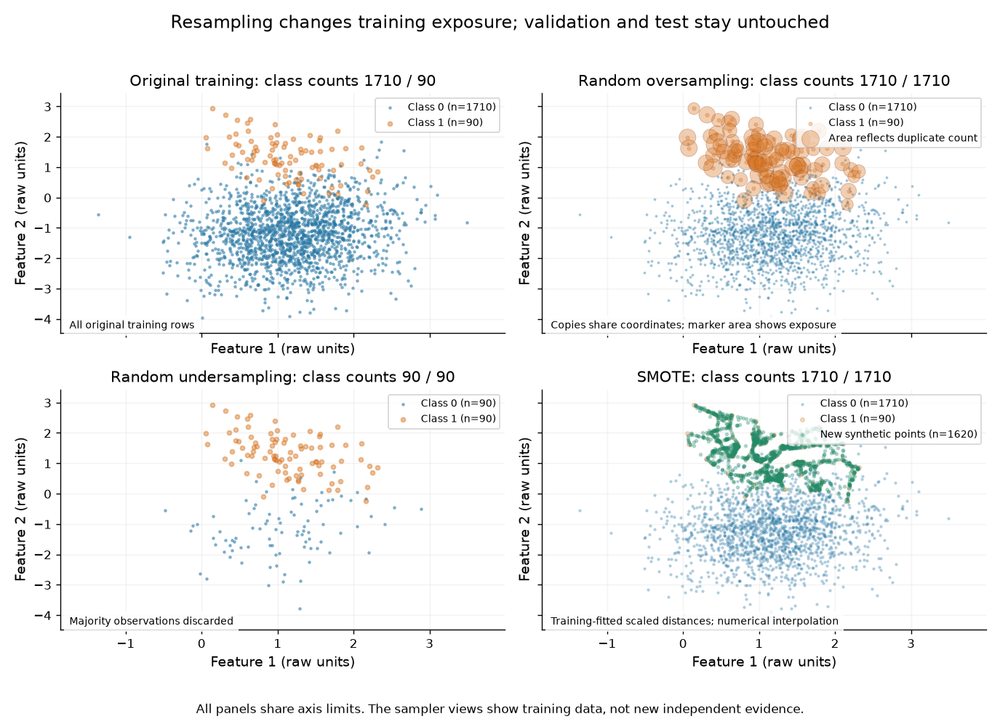
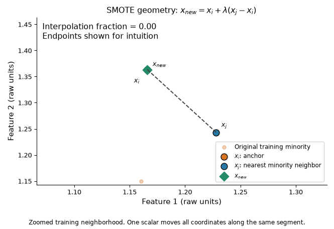

# Day 33 — Visual learning lab

The [generator](visual_imbalanced_data.py) separates training exposure,
probability estimation, ranking, calibration, and decision policy. It creates
12 PNGs, two GIFs, and one offline interactive Plotly HTML. Each view answers
a specific question; none is a benchmark or production validation.

## Run locally

Use the optional dependency group in [pyproject.toml](../../pyproject.toml):

```bash
python -m pip install -e ".[dev,imbalance]"
python 01-classical-machine-learning/33-imbalanced-data/visual_imbalanced_data.py
python -m pytest -q 01-classical-machine-learning/33-imbalanced-data/tests
```

All outputs are relative to the script under `assets/`. Both animations use
36 frames at 8 FPS by default. `--frames 12` gives a shorter sequence.
`--output-dir PATH` selects another output directory. Missing or incompatible
optional dependencies produce an installation instruction. Figures render
headlessly on CPU; opening the HTML in a browser permits rotation, zoom, and
hover without a network connection. No dashboard or web server is required.

Only these three small previews are intentionally unignored and linked:







The other outputs are regenerable local artifacts. The large HTML and
`assets/visual_run.json` stay ignored. Temporary inspection frames under
`assets/inspection/` are intermediate artifacts. The existing topic README
and root progress were left intact; the visual-intuition section is supplied
separately for manual incorporation.

## Visual questions and artifact inventory

| Output under assets/ | Question and observation | Data boundary |
|---|---|---|
| `01_class_imbalance.png` | What does prevalence look like? Compare scatter geometry with the class-count bar chart; visible spread is different from probability mass. | Descriptive synthetic population |
| `02_accuracy_trap.png` | Can accuracy conceal zero positive recall? Compare the always-negative rule with trained logistic regression. | Test; fixed 0.50 |
| `03_confusion_matrix_thresholds.png` | Which counts move at 0.80, 0.50, 0.25, and 0.10? One fitted model supplies every score. | Test demonstration |
| `04_threshold_animation.gif` | What changes when the decision line moves? Watch recall, false alerts, and volume; precision is not guaranteed monotone. | Test demonstration, no selection |
| `05_threshold_metrics.png` | How do precision, recall, F1, F2, and volume differ? Validation max F1 is a metric choice, not an automatic business policy. | Validation selection |
| `06_class_weights_boundary.png` | Does changing the loss change the boundary? Both pipelines see identical rows and train-fitted scaling. | Original training |
| `07_resampling_comparison.png` | Does a sampler add exposure, discard coverage, or interpolate? Oversampling marker area reveals otherwise overlapping duplicates. | Training only |
| `08_smote_geometry.gif` | Why is the formula a line segment? One interpolation fraction moves both feature coordinates. | Zoomed training minority neighborhood |
| `09_smote_failure_mode.png` | What if neighbors span disconnected islands? A constructed fixture generates points in a marked majority region. | Constructed training-only diagnostic |
| `10_roc_vs_pr.png` | Do ROC and PR communicate the same operational story? The same 99/1 test scores generate both curves; AP is explicitly named. | Separate synthetic test set |
| `11_precision_vs_prevalence.png` | Does precision stay constant under prior shift? Bayes PPV varies with prevalence at fixed TPR 0.90 and FPR 0.05. | Theoretical assumptions |
| `12_business_cost_threshold.png` | Do different error costs favor the same threshold? Compare validation minima for costs (1,20) and (10,2). | Validation selection |
| `13_cost_surface.html` | How does preferred threshold change with cost ratio? Rotate the surface and inspect exact-minimum markers. | Validation; C_FP fixed to 1 |
| `14_ranking_vs_decision.png` | Which metrics belong to scores and which belong to actions? AP/AUC remain fixed while confusion counts change. | One model's test scores |
| `15_calibration.png` | Do weighted and ordinary scores match observed frequencies? Inspect actual reliability bins, score histograms, and Brier loss. | Test; no calibrator fitted |

The cost surface connects sampled grid values; empirical threshold cost is
actually stepwise. The orange markers use exact validation decision-set minima,
which may fall between the surface's display thresholds. Its ratio axis is
logarithmic. Fixing C_FP to 1 makes the cost units unambiguous.

## Configuration and leakage boundaries

The main dataset is entirely synthetic `make_classification` data: 3,000
rows, two informative numerical features, no redundant features, 95/5 mixture,
one cluster per class, separation 1.2, and `flip_y=0`. Generator, splitting,
and sampling seeds are 42. Train/validation/test proportions are 60/20/20:
[1710,90], [570,30], and [570,30] negative/positive counts.

Both models fit original training rows through StandardScaler and
`LogisticRegression(C=1, solver="lbfgs", max_iter=1000)`; the second uses
`class_weight="balanced"`. Computed weights are 0.526316 and 10.0.
Samplers operate on training-fitted scaled coordinates, then inverse-transform
for display. Random oversampling and SMOTE yield [1710,1710]; undersampling
yields [90,90]. They are geometric/exposure views, not fitted resampled-model
comparisons. Validation and test are never resampled.

The ROC/PR example has 10,000 rows, ten features (five informative, two redundant),
a 99/1 mixture, two clusters per class, separation 0.8, and no label flips.
Its test set has [1980,20] class counts. It also uses a 60/20/20 stratified split
and seed 42.

Threshold selection enumerates every distinct validation score plus the
no-alert endpoint. Prediction uses score >= threshold. Equal objectives choose
the highest threshold, with fewer alerts on validation. All policy selection
finishes before test probabilities are evaluated. Tests verify that ordering.
No test-based threshold or model selection, cross-validation, or calibration
fitting is performed.

The SMOTE diagnostic is explicitly constructed rather than sampled with
`make_classification`: 250 central negative training points and two islands
of three positive training points each. `k=5` deliberately connects islands.
The marked rectangle is a geometric assumption check, not known mislabeled
ground truth.

## Executed visual experiment record

**Executed by Codex on 2026-10-07. Interpretation candidates require author review.**

**Hypotheses.** Majority accuracy can hide absent minority detection;
threshold changes preserve ranking while changing action counts; different
error costs can prefer different policies; weighting can change probability
quality; cross-island interpolation can challenge SMOTE geometry assumptions.

**Execution.** The full generator was run with the default 36-frame settings.
The final generation took approximately 49.8 seconds in the local environment.
Python 3.11.0rc2; NumPy 2.4.6; scikit-learn 1.9.0; imbalanced-learn 0.14.2;
matplotlib 3.11.0; Pillow 12.3.0; Plotly 6.9.0. Runtime is a local observation,
not a performance benchmark.

**Results.** The 2D baseline's untouched test ROC-AUC was 0.993216 and AP was
0.875061. Those score summaries are unchanged by the decision policies below.

| Policy selected before test evaluation | Threshold | Test precision | Test recall | Test F1 | Test alert rate |
|---|---:|---:|---:|---:|---:|
| Fixed 0.50 | 0.500000 | 0.857143 | 0.800000 | 0.827586 | 0.046667 |
| Validation max F1 | 0.216250 | 0.729730 | 0.900000 | 0.805970 | 0.061667 |
| Validation minimum cost, C_FP=1 / C_FN=20 | 0.041473 | 0.389610 | 1.000000 | 0.560748 | 0.128333 |
| Validation minimum cost, C_FP=10 / C_FN=2 | 0.704553 | 0.894737 | 0.566667 | 0.693878 | 0.031667 |

The always-negative rule had accuracy 0.95 and positive recall 0.
Validation cost was 63 for the (1,20) policy and 40 for the (10,2) policy;
the corresponding test costs were 47 and 46 in their respective illustrative
units. Those raw costs use different cost structures and should not be compared
as competing model scores.

Binary test Brier losses were 0.013752 for ordinary logistic regression and
0.041359 for balanced weights. Six quantile bins per model were displayed;
the test set contains only 30 positives. The separate overlapping 99/1 example
measured test ROC-AUC 0.718030 and AP 0.082093, with 1% prevalence.

The constructed SMOTE fixture generated 244 points; 49 fell inside
`|feature1| < 0.25, |feature2| < 0.65`. This is the chosen diagnostic region,
not an estimated general SMOTE failure probability.

**Initial design check.** The initially executed rare generator used one
cluster per class and separation 1.2 with the same sample size, feature count,
99/1 mixture, and seed. It measured both test ROC-AUC and AP as 1.0. That geometry
did not illustrate the intended ROC/PR trade-off, so the final teaching view
uses the explicitly overlapping two-cluster configuration above. This change
is educational generator design, not evidence of relative model performance.

**Interpretation candidates — pending author review.** The selected F1 policy
increased test recall and workload, while its test F1 was lower than the fixed
0.50 policy. That illustrates selection uncertainty and differing metric
priorities. The cost scenarios favored widely separated thresholds because
their error penalties differ. Weighted outputs had larger Brier loss here,
but this score alone cannot isolate calibration from discrimination.
The cross-island fixture shows a possible interpolation assumption failure.

**Limitations.** One synthetic seed and split per configuration, only 30 primary
and 20 rare test positives, no confidence intervals, and no real operational
costs or review-capacity constraint. Logistic regression and generator geometry
are deliberately simple. Calibration bins are coarse and differ between models;
no calibrator was fitted. The PPV plot assumes unchanged conditional error
rates under prevalence shifts. Constructed failure geometry intentionally
stresses SMOTE and establishes no universal failure rate.

Validation run: 89 topic tests (54 existing and 35 visual), including PNG/GIF
rendering, offline HTML export, numerical parity, sampler boundaries, and
validation-before-test ordering. Representative rendered PNGs and GIF middle
frames were inspected for readability. Browser interaction itself was not
automated.

## Source documentation

The topic's [references](references.md) provide the original SMOTE paper,
class-weight formulas, calibration semantics, and leakage guidance.
Maintained sampler APIs are documented by
[imbalanced-learn SMOTE](https://imbalanced-learn.org/stable/references/generated/imblearn.over_sampling.SMOTE.html)
and [RandomOverSampler](https://imbalanced-learn.org/stable/references/generated/imblearn.over_sampling.RandomOverSampler.html).
Offline export follows [Plotly's HTML documentation](https://plotly.com/python/interactive-html-export/).
