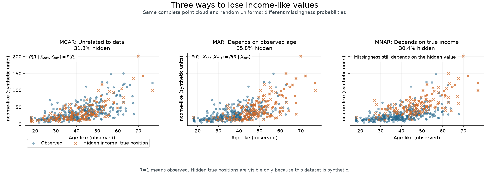
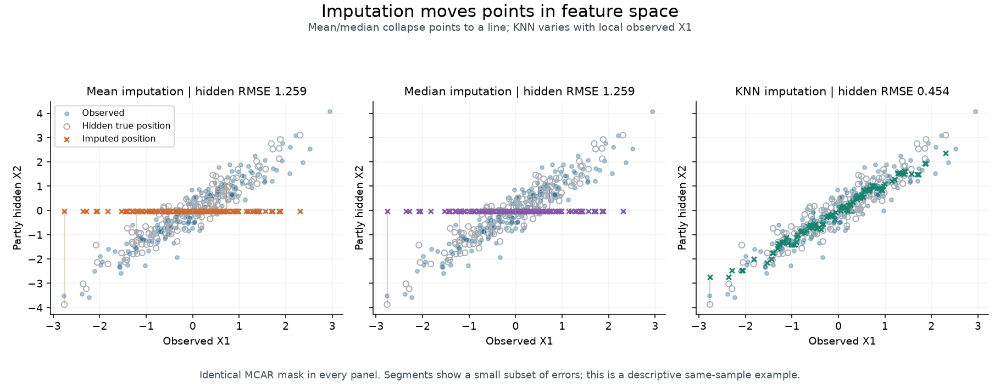
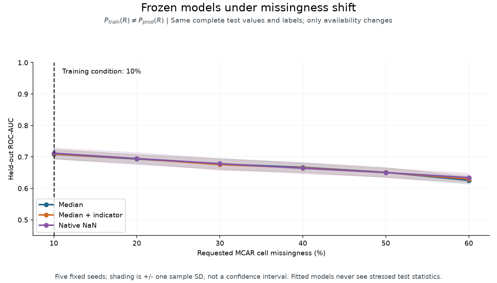

# Day 34 — Missing Data

Why is a value unavailable, and will the prediction pipeline still behave
sensibly when that reason changes? This study connects **MCAR, MAR, and MNAR**
to imputation assumptions, training boundaries, and robustness under feature loss.

MCAR makes missingness independent of the data. MAR makes it independent of
unobserved values **conditional on observed information**. MNAR retains dependence
on unobserved values. These describe mechanisms, not algorithms; a sophisticated
imputer or native NaN routing cannot establish that real missingness is MAR.

The executable comparison uses median imputation, median with missing indicators,
scaled KNN imputation, and histogram gradient boosting with native NaN support.
It selects a fixed workflow by validation ROC-AUC, freezes all models, and then
measures the same test rows under matched missingness, extra dropout, and a
complete outage of an initially available feature. ROC-AUC measures ranking;
Brier score measures probability error. Neither alone defines an acceptable
deployment policy.

Missing-data reasoning matters for optional forms, failed feature joins, sensor
outages, and document extraction. A missing transaction count can mean no activity
or a failed join; those meanings need different data contracts and responses.

## Files and boundaries

| File | Purpose |
|---|---|
| [notes.md](notes.md) | Mechanism definitions, variance distortion, imputation trade-offs, inference versus prediction, and executed experiment record |
| [example.py](example.py) | Four workflows, validation-only selection, paired stress evaluation, subgroup metrics, and distribution diagnostics |
| [from_scratch.py](from_scratch.py) | Educational training-median imputer with fit-time missing indicators and explicit schema checks |
| [tests/test_missing_data.py](tests/test_missing_data.py) | Library agreement, no input mutation, invalid inputs, missingness provenance, training-only statistics, and validation selection |
| [interview_questions.md](interview_questions.md) | Questions about identifiability, uncertainty, leakage, unseen missingness, and operational response |
| [references.md](references.md) | Original statistical papers and official library documentation |

Data are **entirely synthetic**: 2,400 rows and eight numerical features from
`make_classification`, split 60/20/20 with stratification and seed 42.
Separate seeded masks hide `x0` independently, `x1` conditional on observed
`x2`, and `x3` conditional on its own complete value. Labels are never used
to generate masks or impute features. No external data or download is required.

All fitted statistics and KNN donors come from training. The first three
workflows share a random forest configuration; the native workflow also changes
the classifier, so that comparison does not isolate the imputer's effect.
Default indicators cover only features missing during training: the `x2`
outage exposes an important boundary without creating an extra indicator.

## Run from the repository root

Use the shared [dependency configuration](../../pyproject.toml):

```bash
python -m pip install -e ".[dev]"
python 01-classical-machine-learning/34-missing-data/example.py
python 01-classical-machine-learning/34-missing-data/from_scratch.py
python -m pytest -q 01-classical-machine-learning/34-missing-data/tests
```

The example prints validation selection and test metrics, then overwrites
`outputs/comparison.json` relative to its own file. This ignored report
contains configuration, versions, missing rates, subgroup counts and metrics,
distribution diagnostics, limitations, and review status. No generated asset
is required to read the documentation. The scratch script prints stored
training medians and the transformed test rows.

## Recorded behavior

The executed run selected **scaled KNN on validation**. Its test ROC-AUC was
0.9680 with matched missingness, 0.9457 after extra dropout, and 0.9430 during
the `x2` outage. These are measurements from one synthetic split, not benchmarks
or guarantees. The full [experiment record](notes.md#executed-experiment)
includes all workflows and explicit limitations.
**Interpretation candidates remain pending author review.**

## Takeaways

Treat the missingness process as part of the modeling assumptions. Fit
preprocessing inside training boundaries, retain missingness provenance, and
compare behavior when critical features disappear. A pipeline accepting NaN
does not establish that its predictions remain reliable. Deterministic filling
also does not restore the uncertainty needed for statistical inference.

The [validation study](../17-validation-and-leakage/) supplies evaluation
boundaries; [feature engineering](../32-feature-engineering/) explains
availability and point-in-time feature construction.

## CPU visual exploration

Run the independent [visual generator](visualize_missing_data.py):

```bash
python 01-classical-machine-learning/34-missing-data/visualize_missing_data.py
```

It creates 10 scientific PNG figures, one missingness GIF, two optional offline
Plotly HTML views, and an ignored measured experiment report. The
[visual guide and executed measurements](VISUALS.md) explains the custom
synthetic dataset, five-seed experiments, limitations, and output inventory.
The [numerical core](missing_data_visual_core.py) and
[visual tests](tests/test_visual_missing_data.py) separate experiment logic
from rendering. Existing theoretical notes and the earlier example remain
separate from these visual experiments.

Three intentionally unignored previews connect mechanisms, geometry, and
engineering robustness:







Other figures, the animated GIF, HTML files, and JSON reports regenerate
locally and stay ignored. Shaded curves show one sample standard deviation,
not a confidence interval. Interpretations remain pending author review.
