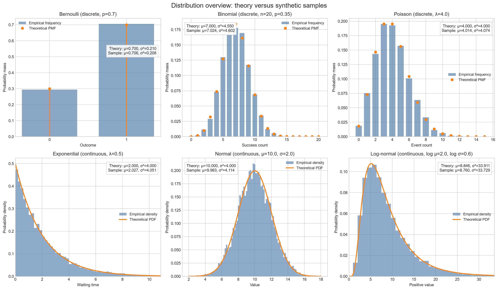

# Applied AI Engineering Lab

A public, AI-assisted study curriculum and technical portfolio connecting
theory, executable code, visual experiments, interview preparation, and
production-oriented reasoning across Data Science and Applied AI Engineering.

[](https://github.com/ivanfborges/applied-ai-engineering-lab/actions/workflows/quality.yml)

## Current Status

**Day 11 of 140 completed — Foundations in progress (11 of 15 topics).**

The repository is being built sequentially as the roadmap is studied. The
current implementation covers AI system boundaries, linear algebra, calculus,
optimization, probability, probability distributions, statistically rigorous
exploratory analysis, sampling design, and CLT-based uncertainty estimation.
Classical Machine Learning starts on Day 16.

- Latest topic: [Central Limit Theorem and Confidence Intervals](00-foundations/11-clt-confidence-intervals/)
- Current module: [Foundations](00-foundations/)
- Full plan: [140-day study roadmap](ROADMAP.md)

Planned modules are not presented as completed work. A module directory is
published only after it contains a reviewed study.

## Highlights

| Study | What it demonstrates | Entry points |
|---|---|---|
| [AI, ML, and GenAI Landscape](00-foundations/01-ai-ml-genai-landscape/) | System boundaries, abstention, retrieval, routing, and telemetry without hiding the underlying components behind an LLM | [`example.py`](00-foundations/01-ai-ml-genai-landscape/example.py), [`notes.md`](00-foundations/01-ai-ml-genai-landscape/notes.md) |
| [Vectors and Matrices](00-foundations/02-linear-algebra-vectors-matrices/) | Vector retrieval metrics, transformation order, tested numerical helpers, and an interactive visual explorer | [`visualizations/app.py`](00-foundations/02-linear-algebra-vectors-matrices/visualizations/app.py), [`tests/`](00-foundations/02-linear-algebra-vectors-matrices/tests/) |
| [Eigenvalues, PCA, and SVD](00-foundations/04-eigenvalues-eigenvectors-pca-svd/) | PCA/SVD equivalence, reconstruction, numerical interpretation, static assets, animations, and an interactive laboratory | [`visual_lab/`](00-foundations/04-eigenvalues-eigenvectors-pca-svd/visual_lab/), [`notebook.ipynb`](00-foundations/04-eigenvalues-eigenvectors-pca-svd/notebook.ipynb) |
| [Probability Essentials](00-foundations/07-probability-essentials/) | Bayes, base rates, expected cost, Monte Carlo convergence, visual explanations, and unit-tested probability utilities | [`visual_lab.py`](00-foundations/07-probability-essentials/visual_lab.py), [`VISUAL_GUIDE.md`](00-foundations/07-probability-essentials/VISUAL_GUIDE.md) |
| [Probability Distributions](00-foundations/08-probability-distributions/) | Distribution assumptions, simulation, likelihood connections, tail behavior, interactive parameter surfaces, and production-oriented examples | [`interactive_dashboard.py`](00-foundations/08-probability-distributions/interactive_dashboard.py), [`notes.md`](00-foundations/08-probability-distributions/notes.md) |
| [Sampling, Bias, and Variance](00-foundations/10-sampling-bias-variance/) | Sampling distributions, persistent selection bias, stratification, weighting, dependence, split leakage, and LLM evaluation design through 16 reproducible visual experiments | [`visual_lab.py`](00-foundations/10-sampling-bias-variance/visual_lab.py), [`tests/`](00-foundations/10-sampling-bias-variance/tests/) |



## Completed Studies

| Day | Topic | Main evidence |
|---:|---|---|
| 1 | [AI/ML/GenAI landscape](00-foundations/01-ai-ml-genai-landscape/) | Executable routing and retrieval example |
| 2 | [Vectors and matrices](00-foundations/02-linear-algebra-vectors-matrices/) | Visual explorer, GIFs, and unit tests |
| 3 | [Vector spaces, bases, and projections](00-foundations/03-vector-spaces-bases-projections/) | Projection implementations and visualization generators |
| 4 | [Eigenvalues, eigenvectors, PCA, and SVD](00-foundations/04-eigenvalues-eigenvectors-pca-svd/) | Visual laboratory, notebook, and numerical tests |
| 5 | [Calculus for ML](00-foundations/05-calculus-for-ml/) | Gradient checks and guided visual exploration |
| 6 | [Gradient descent from scratch](00-foundations/06-gradient-descent-from-scratch/) | Validated optimizer and convergence diagnostics |
| 7 | [Probability essentials](00-foundations/07-probability-essentials/) | Streamlit laboratory, curated assets, and tests |
| 8 | [Probability distributions](00-foundations/08-probability-distributions/) | Dashboard, simulations, estimators, and visual assets |
| 9 | [Exploratory data analysis with statistical rigor](00-foundations/09-exploratory-data-analysis/) | Controlled synthetic experiment and tested descriptive-statistics core |
| 10 | [Sampling, bias, and variance](00-foundations/10-sampling-bias-variance/) | Repeated-sampling experiment and tested estimator diagnostics |
| 11 | [Central Limit Theorem and confidence intervals](00-foundations/11-clt-confidence-intervals/) | CLT and interval-coverage simulations with tested numerical helpers |

## Roadmap

| Sequence | Module | Days | Status |
|---:|---|---:|---|
| 0 | Foundations | 1–15 | **In progress — Day 11 completed** |
| 1 | Classical Machine Learning | 16–35 | Planned |
| 2 | Unsupervised Learning and Recommender Systems | 36–44 | Planned |
| 3 | Experimentation, Causality, and Product Thinking | 45–52 | Planned |
| 4 | Deep Learning | 53–62 | Planned |
| 5 | NLP, Transformers, and LLMs | 63–77 | Planned |
| 6 | Embeddings, Semantic Search, and RAG | 78–88 | Planned |
| 7 | Agents and Agentic Workflows | 89–100 | Planned |
| 8 | MLOps and LLMOps | 101–114 | Planned |
| 9 | AI System Design | 115–122 | Planned |
| 10 | Interview Preparation | 123–132 | Planned |
| 11 | Portfolio Projects | 133–140 | Planned |

See [ROADMAP.md](ROADMAP.md) for the complete day-by-day plan.

## Quick Start

Create and activate a virtual environment from the repository root:

```bash
python -m venv .venv
```

Windows PowerShell:

```powershell
.venv\Scripts\Activate.ps1
```

Linux or macOS:

```bash
source .venv/bin/activate
```

Install the shared runtime, test, and notebook dependencies from the canonical
`pyproject.toml`:

```bash
python -m pip install -e ".[dev,notebooks]"
```

`requirements.txt` remains as a compatibility shortcut for the same command.

Run a lightweight example:

```bash
python 00-foundations/01-ai-ml-genai-landscape/example.py
```

Run a first-principles implementation:

```bash
python 00-foundations/06-gradient-descent-from-scratch/from_scratch.py
```

Run all repository quality checks:

```bash
python scripts/validate_repo.py all
```

The syntax, internal-link, test, and Streamlit smoke-test checks can also be
run separately with `syntax`, `links`, `tests`, or `apps` in place of `all`.

Start a local visual laboratory:

```bash
streamlit run 00-foundations/07-probability-essentials/visual_lab.py
```

Dependencies and version bounds are centralized in `pyproject.toml`. Topic
READMEs document execution commands but do not maintain independent dependency
lists.

## Study Format

Published topics are curated from a broader study session. Depending on the
subject, a topic may contain:

```text
README.md
notes.md
example.py
from_scratch.py
notebook.ipynb
interview_questions.md
references.md
tests/
visualizations/
```

Not every topic needs every file. The structure should follow the technical
question rather than force a template.

The intended evidence is:

- theory connected to executable behavior;
- first-principles implementations where they clarify internals;
- comparisons, failure modes, assumptions, and trade-offs;
- deterministic synthetic experiments without invented benchmarks;
- tests for reusable numerical logic;
- selected visual assets when they materially improve understanding;
- interview questions linked back to the underlying implementation;
- observations and conclusions from experiments that were actually run.

## Repository Layout

```text
applied-ai-engineering-lab/
├── 00-foundations/
├── 01-classical-machine-learning/          # published when started
├── 02-unsupervised-recommender-systems/    # published when started
├── 03-statistics-experimentation/          # published when started
├── 04-deep-learning/                       # published when started
├── 05-transformers-llms/                   # published when started
├── 06-rag-semantic-search/                 # published when started
├── 07-agents/                              # published when started
├── 08-mlops-llmops/                        # published when started
├── 09-ai-system-design/                    # published when started
├── 10-interview-preparation/               # published when started
└── portfolio-projects/                     # Days 133–140
```

The public Git tree may contain only the modules that already have content.
Future directories remain part of the roadmap without being presented as
finished work.

## Scope and Reproducibility

- Examples run locally and do not require paid services or credentials.
- Current studies use synthetic or code-defined data.
- Generated outputs are ignored by default; only selected documentation
  previews are versioned.
- Visual and educational scripts are not production-grade library
  replacements.
- Reported values are demonstrations, not benchmark claims.
- Deployment will be considered only when it adds technical evidence without
  requiring unnecessary ongoing cost.

## AI-Assisted Workflow

AI tools were used as copilots for research, drafting, code suggestions, and
editorial refinement. All published material is reviewed and validated by the
author, who remains responsible for the technical decisions, experiments,
interpretations, and conclusions.

See [Study and Publication Methodology](docs/methodology.md) for the public
workflow and curation principles.

## License

This repository is available under the [MIT License](LICENSE). The examples and
study material may be reused with attribution and without warranty.
